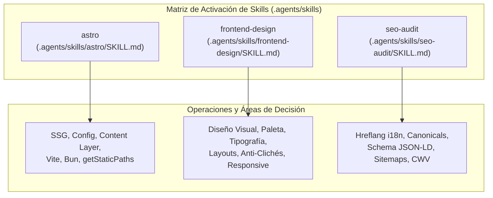

# Plan de Desarrollo: Personal Website & Technical Portfolio — Arturo Nava

## Arquitectura de Rendimiento Extremo & Matriz de Decisión de Skills (2026 Edition)

> **Build Engine & Package Manager:** **Bun v1.4.2** (Nativo, sin dependencias de Corepack, resolución en milisegundos)  
> **Framework Base:** **Astro v7.3.4 (Latest Stable)** — Pure Edge SSG (`output: 'static'`)  
> **Engine de Estilos:** **Tailwind CSS v4.3.3 + @tailwindcss/vite v4.3.3** (Lightning CSS en Rust, sin PostCSS)  
> **Procesamiento de Activos:** **Sharp v0.35.4** (Optimización AVIF/WebP acelerada por hardware SIMD)  
> **Tipado Estricto:** **TypeScript v7.0.2 + @astrojs/check v0.9.10** (`strict: true`, `noImplicitAny: true`)  
> **Target de Despliegue:** **Cloudflare Pages Global Anycast Edge** (TTFB < 25ms mundial)  
> **Presupuesto de Ejecución:** **0 KB baseline client JavaScript** (100/100 Core Web Vitals)  
> **Internacionalización:** **Bilingüe (EN / ES)** con resolución estática instantánea en Build-Time (`translationKey`)

---

## 1. Matriz de Decisión y Activación de Skills (`.agents/skills`)

Cada fase del desarrollo, decisión arquitectónica y archivo de código se rige estrictamente por la activación de la skill especializada correspondiente:



| Operación / Dominio Técnico                                    | Skill Activa      | Ubicación de Referencia                   | Directivas Obligatorias y Entregables                                                                                                                                                                                                                                                                                                                                                                                                                                                                                                           |
| :------------------------------------------------------------- | :---------------- | :---------------------------------------- | :---------------------------------------------------------------------------------------------------------------------------------------------------------------------------------------------------------------------------------------------------------------------------------------------------------------------------------------------------------------------------------------------------------------------------------------------------------------------------------------------------------------------------------------------- |
| **Arquitectura SSG, Componentes Astro, Content Layer y Rutas** | `astro`           | `.agents/skills/astro/SKILL.md`           | - Compilación estática pura (`output: 'static'`) con Bun runtime.<br>- Content Layer API con validación estricta en Zod (`src/content.config.ts`).<br>- Garantía de 0 KB baseline client JS (islas de hidratación prohibidas por defecto).<br>- Computación de filtrado, mapeo y resolución de rutas en el frontmatter (`---`).<br>- Pipeline de imágenes con `astro:assets` (`<Image />` y `<Picture />`).                                                                                                                                     |
| **Identidad Visual, UI/UX, Tipografía y Layouts de Sistemas**  | `frontend-design` | `.agents/skills/frontend-design/SKILL.md` | - Vernáculo de ingeniería para Senior Backend & Distributed Systems (densidad de datos, métricas de latencia, bordes de precisión táctil).<br>- Erradicación de clichés de IA (sin paletas genéricas crema/terracota, sin tarjetas SaaS redondeadas idénticas, sin mayúsculas exageradas ni flechas superfluas).<br>- Tipografía WOFF2 autoalojada (`Geist Sans` / `Geist Mono`), sin CDNs externas, precarga de fuentes críticas.<br>- Primitivas de UI interactivas con CSS nativo (`:has()`, `<details>`, `:popover`) garantizando 0 ms INP. |
| **SEO Técnico, Hreflang i18n, Schema.org y Core Web Vitals**   | `seo-audit`       | `.agents/skills/seo-audit/SKILL.md`       | - URLs canónicas normalizadas sin trailing slashes.<br>- Etiquetas `hreflang` recíprocas y autorreferenciadas (`en`, `es`, `x-default`) en `<head>` y sitemap.<br>- Microformatos JSON-LD estructurados (`ProfilePage`, `Person`, `TechArticle`, `ItemList`).<br>- Cumplimiento estricto de Core Web Vitals (LCP < 0.8s, INP = 0ms, CLS = 0.00, TTFB < 25ms).<br>- Rastreabilidad para motores de búsqueda y crawlers de IA (Perplexity, Claude, ChatGPT).                                                                                      |

---

## 2. Stack Tecnológico de Rendimiento Absoluto (Versiones Exactas 2026)

| Capa                          | Tecnología                               | Versión Latest Estable | Justificación de Rendimiento Absoluto                                                                                                           |
| :---------------------------- | :--------------------------------------- | :--------------------- | :---------------------------------------------------------------------------------------------------------------------------------------------- |
| **Package Manager / Runtime** | **Bun**                                  | `v1.4.2`               | Binario nativo en Zig/C++. Cero dependencia de Corepack. Instalación de dependencias 25x más rápida que npm y ejecución ultra-veloz de scripts. |
| **Framework SSG**             | **Astro**                                | `v7.3.4`               | Generador estático líder. Arquitectura Zero-JS por defecto. Cero código de framework enviado al navegador del cliente.                          |
| **CSS Compiler**              | **Tailwind CSS v4**                      | `v4.3.3`               | Reescrito desde cero con Lightning CSS (Rust). 100x más rápido que PostCSS. Sintaxis `@theme` nativa con CSS variables directas.                |
| **Vite Integration**          | **@tailwindcss/vite**                    | `v4.3.3`               | Compilación atómica en tiempo de build con Vite 6, sin capas intermedias.                                                                       |
| **Image Transformer**         | **Sharp**                                | `v0.35.4`              | Procesamiento SIMD de imágenes a formatos AVIF y WebP de última generación.                                                                     |
| **Sitemap & Feeds**           | **@astrojs/sitemap**<br>**@astrojs/rss** | `v3.7.4`<br>`v4.0.19`  | Generación en tiempo de build de sitemaps conformes con `xhtml:link` para `hreflang` y feeds RSS completos multilingües.                        |
| **Type Checking**             | **TypeScript**<br>**@astrojs/check**     | `v7.0.2`<br>`v0.9.10`  | Tipado estricto en pipelines de contenido, componentes y layouts en tiempo de compilación.                                                      |
| **Edge Hosting**              | **Cloudflare Pages**                     | Pure Static            | Despliegue atómico en 300+ centros de datos con Cloudflare Anycast Edge Cache.                                                                  |

---

## 3. Garantías de Rendimiento y Core Web Vitals (Presupuesto 0 KB JS)

_(Regido por `astro` + `frontend-design` + `seo-audit`)_

1. **0 KB Baseline Client JavaScript:**
   - La arquitectura compila únicamente a HTML5 semántico puro y CSS atómico.
   - Cero frameworks de cliente en runtime.
   - Componentes interactivos como el menú responsive móvil y los acordeones de arquitectura profunda se implementan mediante primitivas nativas de la plataforma web: CSS `:has()`, `<details>`/`<summary>`, y popover API.
2. **Métricas Target de Core Web Vitals (Mobile & Desktop):**
   - **LCP (Largest Contentful Paint):** `< 0.8s` (Fuentes WOFF2 críticas precargadas con `crossorigin`, imágenes héroe optimizadas en WebP con `fetchpriority="high"`).
   - **INP (Interaction to Next Paint):** `0ms` (Al no haber JavaScript bloqueando el hilo principal, la respuesta a clics y toques es instantánea).
   - **CLS (Cumulative Layout Shift):** `0.00` (Dimensiones explícitas de ancho y alto en todas las imágenes y contenedores; fuentes autoalojadas con `font-display: swap`).
   - **TTFB (Time to First Byte):** `< 25ms` a través de Cloudflare Global Anycast Edge.

---

## 4. Motor de Internacionalización (i18n) & "Traducción Instantánea"

_(Regido por `astro` + `seo-audit`)_

El cambio de idioma debe ser **instantáneo** y preservar el contexto exacto de lectura del usuario (deep-link synchronization):

### 4.1 Estructura de Rutas Limpia

- **Inglés (Idioma Principal en Raíz — 0 saltos de redirección):**
  - Homepage: `https://arturonavax.dev/`
  - Proyectos: `https://arturonavax.dev/projects` y `https://arturonavax.dev/projects/[slug]`
  - Trayectoria: `https://arturonavax.dev/experience`
  - Ensayos Técnicos: `https://arturonavax.dev/blog` y `https://arturonavax.dev/blog/[slug]`
  - Feed RSS: `https://arturonavax.dev/rss.xml`
- **Español (Subdirectorio canónico `/es`):**
  - Homepage: `https://arturonavax.dev/es`
  - Proyectos: `https://arturonavax.dev/es/projects` y `https://arturonavax.dev/es/projects/[slug]`
  - Trayectoria: `https://arturonavax.dev/es/experience`
  - Ensayos Técnicos: `https://arturonavax.dev/es/blog` y `https://arturonavax.dev/es/blog/[slug]`
  - Feed RSS: `https://arturonavax.dev/es/rss.xml`

### 4.2 Resolución Bidireccional en Tiempo de Build (`translationKey`)

Cada artículo y proyecto contiene una clave unívoca en su frontmatter: `translationKey: "real-time-fraud-engine-go"`.

```typescript
// src/i18n/utils.ts (Evaluado 100% en tiempo de compilación)
import { getCollection } from "astro:content";

export async function getCounterpartUrl(
  currentLocale: "en" | "es",
  targetLocale: "en" | "es",
  collectionName: "posts" | "projects",
  translationKey: string,
): Promise<string> {
  const entries = await getCollection(collectionName);
  const targetEntry = entries.find(
    (e) =>
      e.data.locale === targetLocale &&
      e.data.translationKey === translationKey,
  );

  if (targetEntry) {
    const slug = targetEntry.id.replace(`${targetLocale}/`, "");
    return targetLocale === "en"
      ? `/${collectionName}/${slug}`
      : `/es/${collectionName}/${slug}`;
  }

  return targetLocale === "en" ? `/${collectionName}` : `/es/${collectionName}`;
}
```

### 4.3 Switch de Idioma Nativo (`LanguageSwitcher.astro`)

- Renderiza un enlace HTML estático: `<a href="{counterpartUrl}" hreflang="{targetLocale}" lang="{targetLocale}">`.
- Con Cloudflare Edge Cache, el usuario experimenta una transición inmediata (< 25ms) sin re-renders en cliente.

---

## 5. Diseño Visual y Vernáculo Técnico

_(Regido por `frontend-design`)_

- **Concepto Visual:** _Infraestructura Crítica, Sistemas Distribuidos de Alta Concurrencia y Criptografía_.
- **Paleta de Alta Disciplina:**
  - Superficie base: `#090a0f` (Negro obsidiana con profundidad de terminal).
  - Contenedores y tarjetas: `#11131a` con bordes sutiles `#1e2433`.
  - Estados activos y foco: `#2563eb` (Cobalto de señalización).
  - Indicador de disponibilidad operativa: `#10b981` (Verde esmeralda palpitante).
  - Texto principal: `#f8fafc` (Slate 50 de máximo contraste).
  - Metadatos y etiquetas: `#94a3b8` / `#64748b`.
- **Tipografía Autoalojada (Zero CDNs):**
  - Fuentes WOFF2 en `public/fonts/` (`Geist Sans` para interfaz y `Geist Mono` para código/hashes/métricas).
  - Preload en `<head>` únicamente para el peso regular de la fuente principal de lectura.
- **Secciones Insignia en la Home:**
  - **Hero de Impacto:** Titular directo (_Senior Backend & Distributed Systems Engineer_), foco en Go, Rust, Concurrencia y Zero-Trust.
  - **Métricas Operacionales en Cuadrícula Compacta:**
    - `Sub-50ms` — POS Checkout Latency (Motor Antifraude Leal)
    - `Millions` — Eventos analíticos OLAP (gosnowflake pipeline)
    - `SIMD / SHA-256` — Throughput criptográfico acelerado (FYLD)
    - `Zero-Trust` — Acceso y mitigación automatizada de riesgos (Mercado Libre)
  - **Proyectos de Arquitectura Destacados:** Tarjetas densas con diagramas esquemáticos, problema resuelto, decisiones técnicas y stack.
  - **Trayectoria Profesional:** Timeline interactivo y accesible basado en los registros reales de Arturo Nava.
  - **Ensayos de Ingeniería:** Lista de artículos con tiempo de lectura y tags.

---

## 6. Especificación del Content Layer (`src/content.config.ts`)

_(Regido por `astro`)_

```typescript
import { defineCollection, z } from "astro:content";
import { glob } from "astro/loaders";

const posts = defineCollection({
  loader: glob({ pattern: "**/*.{md,mdx}", base: "./src/content/posts" }),
  schema: ({ image }) =>
    z.object({
      title: z.string().max(75, "SEO title under 75 chars"),
      description: z.string().max(160, "Meta description under 160 chars"),
      pubDate: z.coerce.date(),
      updatedDate: z.coerce.date().optional(),
      draft: z.boolean().default(false),
      locale: z.enum(["en", "es"]),
      translationKey: z.string(),
      tags: z.array(z.string()).min(1),
      coverImage: image().optional(),
      coverAlt: z.string().optional(),
      canonicalUrl: z.string().url().optional(),
    }),
});

const projects = defineCollection({
  loader: glob({ pattern: "**/*.md", base: "./src/content/projects" }),
  schema: ({ image }) =>
    z.object({
      title: z.string(),
      description: z.string(),
      role: z.string(),
      company: z.string().optional(),
      featured: z.boolean().default(false),
      order: z.number().int(),
      locale: z.enum(["en", "es"]),
      translationKey: z.string(),
      techStack: z.array(z.string()),
      metrics: z
        .array(z.object({ label: z.string(), value: z.string() }))
        .optional(),
      repoUrl: z.string().url().optional(),
      liveUrl: z.string().url().optional(),
      thumbnail: image().optional(),
    }),
});

const experience = defineCollection({
  loader: glob({ pattern: "**/*.md", base: "./src/content/experience" }),
  schema: z.object({
    company: z.string(),
    role: z.string(),
    location: z.string(),
    employmentType: z.string(),
    startDate: z.coerce.date(),
    endDate: z.coerce.date().optional(),
    order: z.number().int(),
    locale: z.enum(["en", "es"]),
    skills: z.array(z.string()),
    keyAchievements: z.array(z.string()),
  }),
});

export const collections = { posts, projects, experience };
```

---

## 7. Technical SEO & Schema.org Structured Data

_(Regido por `seo-audit`)_

- **Canonical & Hreflang:** Generados dinámicamente en `SEOHead.astro`:
  - `hreflang="en"`, `hreflang="es"`, `hreflang="x-default"`.
  - Canonical auto-referenciada estricta sin trailing slashes.
- **JSON-LD Semántico:**
  - Homepage: `schema.org/ProfilePage` con entidad anidada `schema.org/Person` (`jobTitle: "Senior Software Engineer"`, `sameAs: [LinkedIn, GitHub]`, `knowsAbout: [...]`).
  - Artículos: `schema.org/TechArticle` con fecha, autor y tiempo de lectura.
  - Proyectos: `schema.org/ItemList` con vínculos descriptivos.
- **Sitemap XML & RSS:**
  - Sitemap multilingüe vía `@astrojs/sitemap`.
  - RSS completo en `src/pages/rss.xml.ts` (inglés) y `src/pages/es/rss.xml.ts` (español).
- **Robots.txt:** Configurado con enlace directo al sitemap.

---

## 8. Cloudflare Pages & Configuración Edge (`public/_headers`)

_(Regido por `astro` + `seo-audit`)_

```http
# Activos inmutables generados por Vite / Astro (1 año de cache)
/_astro/*
  Cache-Control: public, max-age=31536000, immutable

# Fuentes WOFF2 autoalojadas
/fonts/*
  Cache-Control: public, max-age=31536000, immutable
  Access-Control-Allow-Origin: *

# Documentos HTML (revalidación inmediata para despliegues atómicos sin cache stale)
/*.html
  Cache-Control: public, max-age=0, must-revalidate
/
  Cache-Control: public, max-age=0, must-revalidate
/es
  Cache-Control: public, max-age=0, must-revalidate

# Seguridad y Blindaje Edge
/*
  X-Content-Type-Options: nosniff
  X-Frame-Options: DENY
  Referrer-Policy: strict-origin-when-cross-origin
  Permissions-Policy: accelerometer=(), camera=(), geolocation=(), gyroscope=(), magnetometer=(), microphone=(), payment=(), usb=()
  Content-Security-Policy: default-src 'self'; script-src 'self' 'unsafe-inline'; style-src 'self' 'unsafe-inline'; img-src 'self' data: https:; font-src 'self'; connect-src 'self';
```

---

## 9. Cronograma de Implementación por Fases & Mapeo de Skills

1. **Fase 1: Inicialización con Bun v1.4.2 & Fundaciones:** _(Skills: `astro` + `frontend-design`)_
   - Crear `package.json` con dependencias en sus versiones exactas más recientes.
   - Configurar `astro.config.mjs`, `tsconfig.json` y Tailwind v4 con `@tailwindcss/vite`.
   - Añadir fuentes WOFF2 en `public/fonts/` y reglas de borde en `public/_headers` y `public/robots.txt`.
2. **Fase 2: Motor i18n & Content Layer:** _(Skills: `astro` + `seo-audit`)_
   - Definir `src/content.config.ts` y utilidades i18n (`ui.ts`, `utils.ts`).
   - Crear el contenido en inglés y español para `experience/`, `projects/` y `posts/` a partir de `ArturoNava-linkedin-en.md`.
3. **Fase 3: Layouts y Componentes Base:** _(Skills: `astro` + `frontend-design` + `seo-audit`)_
   - Crear `SEOHead.astro`, `LanguageSwitcher.astro` (zero-JS), `Header.astro` y `Footer.astro`.
   - Crear `BaseLayout.astro` y `ArticleLayout.astro`.
4. **Fase 4: Componentes Especializados de Portfolio:** _(Skills: `frontend-design`)_
   - Crear `MetricCallout.astro`, `ProjectCard.astro`, `ExperienceTimeline.astro` y `PostCard.astro`.
5. **Fase 5: Rutas Bilingües y Feeds:** _(Skills: `astro` + `seo-audit`)_
   - Páginas en inglés (`/`, `/projects`, `/projects/[slug]`, `/experience`, `/blog`, `/blog/[slug]`, `/rss.xml.ts`).
   - Páginas en español (`/es`, `/es/projects`, `/es/projects/[slug]`, `/es/experience`, `/es/blog`, `/es/blog/[slug]`, `/es/rss.xml.ts`).
   - Página `404.astro`.
6. **Fase 6: Verificación y Auditoría de Rendimiento:** _(Skills: `seo-audit` + `astro`)_
   - `bun run check` (TypeScript estricto sin errores).
   - `bun run build` (Compilación estática completa a `dist/`).
   - Auditoría de bundles en `dist/` (0 KB client framework JS).
   - Verificación de sitemaps XML, RSS y etiquetas hreflang.
