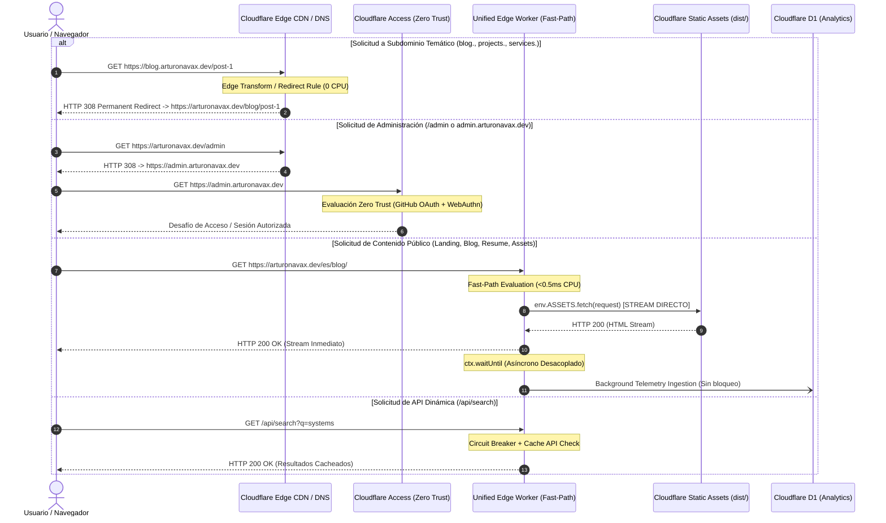
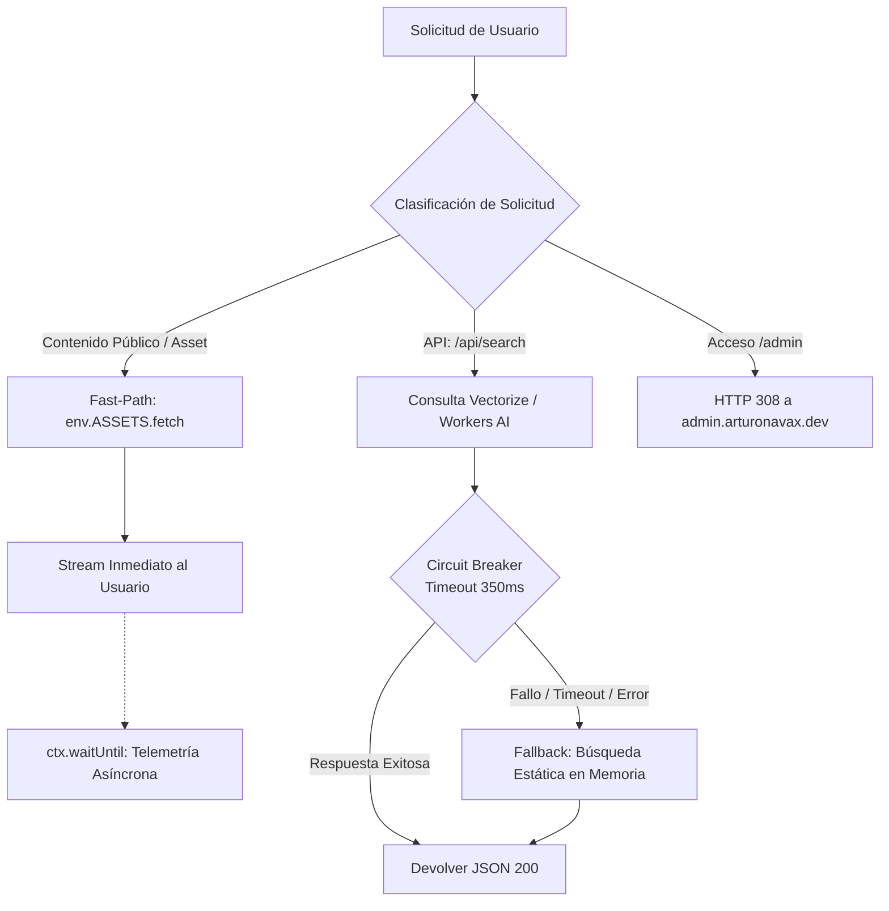

# SPEC-005: ENTREGA DE CONTENIDO EDGE DE ALTO RENDIMIENTO Y AISLAMIENTO DE INFRAESTRUCTURA DE CERO LATENCIA

## Arquitectura Perimetral Content-First en Cloudflare Edge, Aislamiento de Zero Trust, Normalización de Subdominios y Resiliencia Fail-Open

```yaml
id: SPEC-005-EDGE-CONTENT-PERFORMANCE
title: Performance-Driven Edge Content Delivery, Zero Trust Isolation & Subdomain Normalization Specification
status: PROPOSED
version: 1.0.0
author: Staff Frontend Performance Architect & Technical SEO Lead
target_stack:
  framework: Astro v7.3.4+ (Compilación Estática Pura / ClientRouter)
  styling: Tailwind CSS v4.3.3+ (CSS-First @theme Engine / LightningCSS)
  runtime: Cloudflare Edge (Workers, Workers Static Assets, D1, R2, Vectorize, Cache API, Cloudflare Access)
  architecture: Hexagonal / Decoupled Ports & Adapters / Fail-Open Isolation
  locales: [en, es] (EN Primario -> ES Secundario -> Extensible N)
methodology: Tri-Axis Model — Spec-Driven Development (SDD), Requirement-Driven Development (RDD) & Organic/Operational-Driven Development (ODD)
cross_references:
  spec_001: openspec/specs/SPEC-001-big-refactor.md
  spec_002: openspec/specs/SPEC-002-general-tasks.md
  spec_003: openspec/specs/SPEC-003-future-improves.md
  spec_004: openspec/specs/SPEC-004-audit.md
  spec_005: openspec/specs/SPEC-005-performance-content-delivery.md
```

---

## 1. Resumen Ejecutivo, Diagnóstico y Alineación Metodológica

### 1.1. Contexto y Diagnóstico del Sistema

El ecosistema web de `arturonavax.dev` ha alcanzado un alto nivel de madurez técnica con la adopción de Astro v7 en modo puramente estático (`output: 'static'`), arquitectura hexagonal desacoplada de puertos y adaptadores ([`SPEC-003`](file:///home/arthurnavah/repos/github.com/arturonavax/personal-website/openspec/specs/SPEC-003-future-improves.md)), y auditorías automatizadas de calidad extrema ([`SPEC-004`](file:///home/arthurnavah/repos/github.com/arturonavax/personal-website/openspec/specs/SPEC-004-audit.md)).

No obstante, un análisis arquitectónico exhaustivo del pipeline de ejecución perimetral actual en Cloudflare Edge ha puesto de manifiesto riesgos críticos de degradación de latencia inducida por infraestructura:

1. **Intercepción Síncrona Universal en Worker (`run_worker_first: true`):**
   En [`wrangler.jsonc`](file:///home/arthurnavah/repos/github.com/arturonavax/personal-website/wrangler.jsonc), la directiva `run_worker_first: true` obliga a que el 100% de las solicitudes entrantes (incluyendo páginas HTML estáticas, fuentes tipográficas críticas WOFF2, hojas de estilo CSS y activos inmutables) ejecuten el script [`cloudflare/worker.ts`](file:///home/arthurnavah/repos/github.com/arturonavax/personal-website/cloudflare/worker.ts) antes de llegar a `env.ASSETS.fetch(request)`.
2. **Cómputo Previo en Hilo Crítico de Solicitudes GET:**
   A pesar de que la persistencia en D1 se encapsula en `ctx.waitUntil(recordAnalytics(...))`, el Worker ejecuta parsing de URLs, comprobaciones complejas con expresiones regulares (`BOT_REGEX`, `STATIC_EXT_REGEX`), normalización de referrers y hashing criptográfico síncrono previo en memoria, sumando entre 5 ms y 20 ms innecesarios de tiempo de CPU y arranque de V8 Isolate al TTFB (_Time to First Byte_) de navegación.
3. **Riesgo de Acoplamiento de Políticas Zero Trust (Cloudflare Access):**
   La incorporación de dashboards administrativos privados y métricas protegidas mediante Cloudflare Access dentro del mismo hostname apex (`arturonavax.dev/admin/*`) introduce la evaluación de políticas perimetrales, validación de JWTs de identidad y comprobaciones de cookies sobre el mismo pipeline de enrutamiento que atiende a los visitantes públicos.
4. **Dispersión de Autoridad SEO por Subdominios Temáticos:**
   La proyección de disponer de accesos directos por subdominio (`blog.arturonavax.dev`, `projects.arturonavax.dev`, `services.arturonavax.dev`, `experience.arturonavax.dev`) exige un mecanismo perimetral de redirección inmediata que no penalice la velocidad con saltos lentos ni fragmente la autoridad de dominio (_Link Equity_ y _PageRank_).

---

### 1.2. Principio Rector Inviolable: "Content-First Edge Delivery"

```
                         CONTENT-FIRST EDGE INVARIANT
 ┌────────────────────────────────────────────────────────────────────────┐
 │ REGLA #1: La entrega de contenido público al usuario es la prioridad    │
 │ absoluta e inviolable. Cero milisegundos de latencia añadida.           │
 │                                                                        │
 │ Ninguna integración auxiliar (Access, D1, Vectorize, R2, AI, Turnstile) │
 │ podrá jamás bloquear, demorar ni degradar el acceso al contenido.      │
 └────────────────────────────────────────────────────────────────────────┘
```

Bajo este principio:

- **Fast-Path Inmediato:** Las solicitudes de contenido público se resuelven a velocidad de cable de red CDN (_Edge Wire Speed_), eliminando cualquier paso intermedio no estrictamente requerido para emitir bytes al cliente.
- **Aislamiento Físico y Perimetral:** Las herramientas de administración, auditoría y dashboards protegidos con Cloudflare Access residirán en un subdominio dedicado (`admin.arturonavax.dev`), mientras que cualquier acceso por path (`arturonavax.dev/admin`) ejecutará una redirección 308 inmediata a nivel de Edge sin despertar cómputo pesado.
- **Fail-Open Garantizado:** Si cualquier base de datos (D1), servicio de inferencia (Workers AI), almacenamiento de vectores (Vectorize) o webhook externo falla o supera un timeout estricto, la entrega de contenido y navegación del sitio web público continuará funcionando al 100% de manera transparente y resiliente.

---

### 1.3. Marco Metodológico Tri-Axis: SDD, RDD y ODD

```
                             TRI-AXIS METHODOLOGY MODEL
                                      [ SDD ]
                           Contratos de Enrutamiento Edge
                           y Arquitectura Fail-Open Pura
                                        ▲
                                       / \
                                      /   \
                                     /     \
                                    ▼       ▼
                               [ RDD ] <──> [ ODD ]
                          Compuertas        Telemetría Zero-Overhead,
                          Cuantitativas de  Simulación de Caos Edge
                          TTFB y Rendimiento y Benchmarks de Concurrencia
```

- **Spec-Driven Development (SDD):** Modelado formal en TypeScript estricto de las interfaces de enrutador perimetral (`EdgeContentDeliveryPort`, `EdgeRoutingPolicy`, `SubdomainRedirectRule`), contratos de aislamiento de telemetría y directivas de cabeceras RFC 9111.
- **Requirement-Driven Development (RDD):** Definición binaria e inexcusable de compuertas cuantitativas (`REQ-PCD-01` a `REQ-PCD-08`), evaluadas mediante límites numéricos estrictos (TTFB < 20ms en caché Edge, 0ms de bloqueo de hilo en navegación, 0 KB JS cliente).
- **Organic/Operational-Driven Development (ODD):** Validación operativa bajo condiciones perimetrales adversas en los más de 300 centros de datos de Cloudflare: inyección de fallas en D1/Vectorize, verificación de aislamiento de Access y benchmarking global de latencia.

---

### 1.4. Matriz de Trazabilidad y Referencias Cruzadas entre Especificaciones

- **Conexión con [SPEC-001: Arquitectura Enterprise Edge y Rutas Dinámicas i18n](file:///home/arthurnavah/repos/github.com/arturonavax/personal-website/openspec/specs/SPEC-001-big-refactor.md):** SPEC-005 blinda la entrega de las 14 rutas dinámicas parametrizadas bajo `src/pages/[...lang]/`, asegurando que la resolución estática no sufra retrasos de procesamiento de cabeceras en el Edge.
- **Conexión con [SPEC-002: Refactorización General y Resume Studio](file:///home/arthurnavah/repos/github.com/arturonavax/personal-website/openspec/specs/SPEC-002-general-tasks.md):** SPEC-005 garantiza que las descargas de PDFs compilados y llamadas a `/resume/maker/` aprovechen la caché perimetral sin que la telemetría síncrona afecte la fluidez del usuario.
- **Conexión con [SPEC-003: Arquitectura Hexagonal y Cloudflare Edge Desacoplado](file:///home/arthurnavah/repos/github.com/arturonavax/personal-website/openspec/specs/SPEC-003-future-improves.md):** SPEC-005 refactoriza los adaptadores de D1, R2 y Vectorize introducidos en SPEC-003 para imponerles políticas estrictas de _Fail-Open_, presupuestos de sub-solicitudes perimetrales y ejecución asíncrona desacoplada del hilo de respuesta.
- **Conexión con [SPEC-004: Auditoría Arquitectónica Global y Verificación Extrema](file:///home/arthurnavah/repos/github.com/arturonavax/personal-website/openspec/specs/SPEC-004-audit.md):** SPEC-005 complementa el scorecard de auditoría de SPEC-004 con compuertas de tiempo de ejecución perimetral (TTFB, presupuesto de CPU del Worker, comprobación de ausencia de cookies de Access en rutas públicas).

---

## 2. Matriz de Requerimientos y Compuertas Cuantitativas (RDD)

### 2.1. Requerimientos Funcionales y Técnicos (REQ-PCD-*)

| ID             | Requerimiento Técnico                                      | Componente / Capa Afectada                  | Criterio de Aceptación (PASS)                                                                                                                                                                                                                                                                                                                                                                 |
| :------------- | :--------------------------------------------------------- | :------------------------------------------ | :-------------------------------------------------------------------------------------------------------------------------------------------------------------------------------------------------------------------------------------------------------------------------------------------------------------------------------------------------------------------------------------------- |
| **REQ-PCD-01** | **Zero-Compute Static Fast-Path**                          | `cloudflare/worker.ts`, `wrangler.jsonc`    | Las solicitudes de documentos HTML, activos fingerprinted (`/_astro/*`), fuentes (`/fonts/*`) e imágenes se transmiten de inmediato sin cómputo previo de DB ni hashing en el hilo de respuesta.                                                                                                                                                                                              |
| **REQ-PCD-02** | **Cloudflare Access & Dashboard Dual-Surface Isolation**   | Cloudflare Access, DNS, Worker Router       | El panel administrativo opera en `admin.arturonavax.dev` bajo políticas Cloudflare Access dedicadas. La ruta `arturonavax.dev/admin` emite un HTTP 308 permanente hacia el subdominio sin evaluar autenticación en el apex.                                                                                                                                                                   |
| **REQ-PCD-03** | **Subdomain Canonicalization Engine**                      | Cloudflare Edge Rules, Worker Router        | Subdominios temáticos (`blog.`, `projects.`, `services.`, `experience.`) se normalizan hacia el apex mediante redirección 308 a nivel de CDN Edge sin consumo de ciclos CPU de Worker.                                                                                                                                                                                                        |
| **REQ-PCD-04** | **Asynchronous Non-Blocking Telemetry & Shielding**        | `cloudflare/worker.ts`, `src/lib/adapters/` | La recolección de métricas no añade ni 1 ms de latencia a la respuesta del usuario. Se ejecuta exclusivamente vía `ctx.waitUntil()` o mediante balizas desacopladas (`navigator.sendBeacon`).                                                                                                                                                                                                 |
| **REQ-PCD-05** | **Fail-Open Resilience Invariant**                         | `cloudflare/worker.ts`, `src/lib/adapters/` | Ante caída catastrófica, saturación o timeout (>500ms) de D1, Vectorize, Turnstile o Workers AI, el Worker degrada elegantemente: el contenido se entrega sin error HTTP 500.                                                                                                                                                                                                                 |
| **REQ-PCD-06** | **Multi-Tier Edge Caching & RFC 9111 Invariants**          | `public/_headers`, `cloudflare/worker.ts`   | Cabeceras deterministas: `immutable` para activos con hash, `s-maxage=604800, stale-while-revalidate=86400` para R2 y APIs cacheadas, y revalidación inmediata para HTML.                                                                                                                                                                                                                     |
| **REQ-PCD-07** | **Sub-Request & Worker CPU Budgeting**                     | `cloudflare/worker.ts`, `wrangler.jsonc`    | Consumo de CPU de Worker en Fast-Path < 1.0 ms. Presupuesto de sub-solicitudes en rutas públicas = 0 (excepto llamadas de background en `ctx.waitUntil`).                                                                                                                                                                                                                                     |
| **REQ-PCD-08** | **Strict Core Web Vitals Edge SLA**                        | `src/components/`, `cloudflare/`            | TTFB en Cache Hit < 20 ms en PoP local; LCP < 800 ms; INP = 0 ms; CLS = 0.000; 0 KB de JavaScript cliente en rutas informacionales.                                                                                                                                                                                                                                                           |
| **REQ-PCD-09** | **Deterministic Multilingual SEO & Phantom 404 Shielding** | `src/i18n/`, `src/components/`              | Detección de idioma en raíz con persistencia permanente (`localStorage` + cookie). Preservación estricta de deep links y referrers de búsqueda sin redirecciones forzadas. Supresión de `hreflang` para contenidos sin traducción (0 errores 404). Banner discreto de sugerencia de idioma (`LanguageSuggestionBanner`) respetando traducción nativa de navegador para idiomas no soportados. |

---

### 2.2. Criterios de Aceptación Cuantitativos y Umbrales de Rendimiento

```
                          QUANTITATIVE PERFORMANCE THRESHOLDS
 ┌───────────────────────────────┬──────────────────────┬──────────────────────┐
 │ Métrica                       │ Condición PASS       │ Condición FAIL       │
 ├───────────────────────────────┼──────────────────────┼──────────────────────┤
 │ TTFB (Edge Cache Hit)         │ ≤ 20 ms              │ > 50 ms              │
 │ TTFB (Document Fast-Path)     │ ≤ 45 ms              │ > 90 ms              │
 │ CPU Time en Worker (Fast-Path)│ < 1.0 ms             │ ≥ 2.5 ms             │
 │ Sub-requests en Hilo Crítico  │ 0 llamadas síncronas │ ≥ 1 llamada externa  │
 │ Tiempo de Fallback Fail-Open  │ < 15 ms              │ Timeout o HTTP 500   │
 │ Impacto de Access en Apex     │ 0 bytes cookies / JWT│ Cabeceras CF-Access  │
 │ Redirección de Subdominio     │ HTTP 308 en Edge CDN │ Saltos múltiples 302 │
 │ Client JS en Contenido        │ 0.0 KB               │ > 0.0 KB             │
 └───────────────────────────────┴──────────────────────┴──────────────────────┘
```

---

## 3. Especificación del Sistema, Tipos e Invariantes Formales (SDD)

### 3.1. Arquitectura Perimetral y Diagrama de Secuencia de Enrutamiento



---

### 3.2. Contratos de Enrutamiento y Puertos Hexagonales en TypeScript

Para desacoplar el enrutamiento y garantizar la compuerta de rendimiento, se formalizan los contratos de interfaz en `src/lib/ports/edge-delivery.ts`:

```typescript
// src/lib/ports/edge-delivery.ts

/**
 * Categorías de clasificación determinista de tráfico perimetral.
 */
export type RequestClassification =
  | "STATIC_ASSET" // Activos inmutables: /_astro/*, /fonts/*, favicon
  | "PUBLIC_DOCUMENT" // Páginas HTML públicas: /, /blog/*, /resume/*, etc.
  | "ADMIN_SURFACE" // Rutas administrativas que deben redirigirse a Access
  | "SUBDOMAIN_ALIAS" // Subdominios que requieren normalización canónica
  | "DYNAMIC_API" // Endpoints API: /api/search, /api/verify-captcha
  | "TELEMETRY_INGESTION" // Ingesta de métricas: /api/v1/telemetry
  | "PASSTHROUGH"; // Otros recursos no mapeados

/**
 * Contrato formal para la política de enrutamiento perimetral ultra-rápida.
 */
export interface EdgeRoutingPolicyPort {
  /**
   * Clasifica la solicitud entrante en menos de 0.2ms de tiempo de cómputo.
   */
  classify(url: URL, request: Request): RequestClassification;

  /**
   * Determina si la solicitud debe redirigirse a nivel de Edge hacia la superficie canónica.
   */
  resolveCanonicalRedirect(url: URL): {
    shouldRedirect: boolean;
    targetUrl?: string;
    statusCode: 308 | 301;
  };

  /**
   * Resuelve si el recurso es candidato a Fast-Path sin procesamiento en hilo crítico.
   */
  isFastPathCandidate(classification: RequestClassification): boolean;
}

/**
 * Contrato de resiliencia Fail-Open para operaciones auxiliares del Edge.
 */
export interface FailOpenCircuitBreakerPort {
  /**
   * Ejecuta una operación de infraestructura (D1, Vectorize, AI) con timeout estricto.
   * Si la operación excede el timeout o lanza error, retorna fallbackValue sin interrumpir.
   */
  executeWithFallback<T>(
    operation: () => Promise<T>,
    fallbackValue: T,
    timeoutMs: number,
    operationName: string,
  ): Promise<T>;
}
```

---

### 3.3. Refactorización del Pipeline de Worker (`cloudflare/worker.ts`)

La arquitectura de `cloudflare/worker.ts` se estructurará bajo el patrón **Early-Exit Stream Pipeline**:

```typescript
// cloudflare/worker.ts (Diseño Arquitectónico Fast-Path)

import { handleAnalyticsRollup } from "./cron-scheduler";
import { processIncomingEmail } from "./email-worker";
import {
  createSearchAdapter,
  createCaptchaAdapter,
  createStorageAdapter,
} from "../src/lib/adapters";

export default {
  async fetch(
    request: Request,
    env: Env,
    ctx: ExecutionContext,
  ): Promise<Response> {
    const url = new URL(request.url);
    const host = url.hostname.toLowerCase();

    // -------------------------------------------------------------------------
    // 1. FAST-PATH: Normalización de Subdominios Canónicos (SEO & Link Equity)
    // -------------------------------------------------------------------------
    // Subdominios temáticos se redirigen inmediatamente a la ruta canónica en apex
    if (
      host !== "arturonavax.dev" &&
      host !== "localhost" &&
      !host.endsWith(".workers.dev")
    ) {
      // Subdominio Administrativo: protegido por Cloudflare Access (No redirigir)
      if (host === "admin.arturonavax.dev" || host === "dash.arturonavax.dev") {
        return handleAdminDashboardRequest(request, env, ctx);
      }

      // Mapeo determinista de subdominios temáticos
      const targetPath = resolveSubdomainPath(host, url.pathname);
      if (targetPath) {
        return Response.redirect(
          `https://arturonavax.dev${targetPath}${url.search}`,
          308,
        );
      }
    }

    // -------------------------------------------------------------------------
    // 2. FAST-PATH: Redirección de Superficie Administrativa en Apex
    // -------------------------------------------------------------------------
    if (url.pathname === "/admin" || url.pathname.startsWith("/admin/")) {
      const adminPath = url.pathname.replace(/^\/admin/, "") || "/";
      return Response.redirect(
        `https://admin.arturonavax.dev${adminPath}${url.search}`,
        308,
      );
    }

    // -------------------------------------------------------------------------
    // 3. FAST-PATH: Activos Estáticos Inmutables e Imágenes
    // -------------------------------------------------------------------------
    const pathname = url.pathname;
    const isImmutableAsset =
      pathname.startsWith("/_astro/") || pathname.startsWith("/fonts/");
    if (isImmutableAsset) {
      const response = await env.ASSETS.fetch(request);
      const headers = new Headers(response.headers);
      headers.set("Cache-Control", "public, max-age=31536000, immutable");
      return new Response(response.body, { status: response.status, headers });
    }

    // -------------------------------------------------------------------------
    // 4. API Endpoints Dedicados (Search, Captcha, Ingestion)
    // -------------------------------------------------------------------------
    if (pathname.startsWith("/api/")) {
      return handleApiRoutes(request, env, ctx, url);
    }

    // -------------------------------------------------------------------------
    // 5. FAST-PATH: Entrega Inmediata de Documentos Públicos (HTML)
    // -------------------------------------------------------------------------
    // Se inicia el fetch de activos INMEDIATAMENTE sin esperar cómputo ni DB
    const assetResponsePromise = env.ASSETS.fetch(request);

    // Telemetría en segundo plano 100% no bloqueante vía ctx.waitUntil
    const isPrefetch =
      request.headers.get("purpose") === "prefetch" ||
      request.headers.get("sec-purpose")?.includes("prefetch");

    if (request.method === "GET" && !isPrefetch && env.DB) {
      ctx.waitUntil(recordAnalyticsNonBlocking(request, pathname, env.DB));
    }

    const response = await assetResponsePromise;

    // Normalización de cabeceras de caché para PDFs
    if (pathname.endsWith(".pdf")) {
      const headers = new Headers(response.headers);
      headers.set(
        "Cache-Control",
        "public, max-age=86400, s-maxage=604800, stale-while-revalidate=86400",
      );
      return new Response(response.body, { status: response.status, headers });
    }

    return response;
  },
};
```

---

### 3.4. Aislamiento de Cloudflare Access y Reglas de Subdominio

Para garantizar que Cloudflare Access jamás interfiera en el tráfico de visitantes:

1. **Aislamiento de Aplicación en Cloudflare Zero Trust:**
   - La aplicación de Cloudflare Access se vincula exclusivamente al dominio `admin.arturonavax.dev`.
   - Cero políticas de Access aplicadas en el apex `arturonavax.dev`.
   - Cabeceras de autenticación (`Cf-Access-Jwt-Assertion`, `Cf-Access-Token`) estrictamente confinadas al subdominio.
2. **Redirecciones Canónicas de Subdominios Temáticos:**
   - `blog.arturonavax.dev/*` $\to$ `https://arturonavax.dev/blog/*` (HTTP 308)
   - `projects.arturonavax.dev/*` $\to$ `https://arturonavax.dev/projects/*` (HTTP 308)
   - `services.arturonavax.dev/*` $\to$ `https://arturonavax.dev/services/*` (HTTP 308)
   - `experience.arturonavax.dev/*` $\to$ `https://arturonavax.dev/experience/*` (HTTP 308)
   - `resume.arturonavax.dev/*` $\to$ `https://arturonavax.dev/resume/*` (HTTP 308)
   - `maker.arturonavax.dev/*` $\to$ `https://arturonavax.dev/resume/maker/*` (HTTP 308)

Estas redirecciones se implementarán preferentemente en **Cloudflare Edge Redirect Rules** (Reglas de Enrutamiento CDN gestionadas en la zona DNS) para que se resuelvan en $< 5\text{ ms}$ sin ejecutar código Worker. El Worker mantendrá la lógica como fallback perimetral.

---

### 3.5. Arquitectura Fail-Open y Circuit Breaker



---

## 4. Verificación Operativa, Telemetría y Validación en Tiempo de Ejecución (ODD)

### 4.1. Pruebas de Resistencia y Simulación de Caos Edge

La validación operativa requerirá un script de verificación automatizado en `tests/spec-005/edge-performance.spec.ts` ejecutado mediante Bun/Playwright:

1. **Prueba de Inyección de Falla en D1 (D1 Blackhole Test):**
   - Se intercepta o desconecta el binding `env.DB`.
   - Se realizan 50 solicitudes GET concurrentes a `/`, `/blog/`, `/resume/`.
   - **Criterio de Aprobación:** 100% de las solicitudes retornan HTTP 200 con TTFB $< 30\text{ ms}$. Cero errores HTTP 500. Cero excepciones visibles para el cliente.
2. **Prueba de Aislamiento de Cloudflare Access (Access Shielding Test):**
   - Solicitudes directas a `https://arturonavax.dev/` y `https://arturonavax.dev/blog/`.
   - **Criterio de Aprobación:** Ausencia total de cookies `CF_Authorization`, ausencia de cabeceras de desafío de Access y tiempo de procesamiento en Edge $< 1.0\text{ ms}$ de CPU.
   - Solicitud a `https://arturonavax.dev/admin`.
   - **Criterio de Aprobación:** Retorno inmediato de HTTP 308 con `Location: https://admin.arturonavax.dev/`.
3. **Prueba de Normalización de Subdominios (Canonical Redirect Benchmark):**
   - Peticiones a `https://blog.arturonavax.dev/test-post` y `https://services.arturonavax.dev/consulting`.
   - **Criterio de Aprobación:** HTTP 308 determinista hacia las URLs canónicas del apex, preservando query params sin pérdidas y con latencia perimetral $< 15\text{ ms}$.
4. **Prueba de Sobrecarga de Telemetría (Telemetry Decoupling Benchmark):**
   - Ráfaga de 500 peticiones a `/api/v1/telemetry` con payloads grandes.
   - **Criterio de Aprobación:** Respuesta HTTP 202 Inmediata en $< 10\text{ ms}$; el hilo de procesamiento de páginas públicas permanece completamente inmutable en su latencia p99.

---

### 4.2. Benchmarking Global de TTFB en Red Perimetral

Se establecen compuertas de medición continua utilizando Cloudflare Observability y synthetic monitoring:

```bash
# Simulación de verificación de TTFB perimetral Fast-Path
curl -o /dev/null -s -w "HTTP: %{http_code} | TTFB: %{time_starttransfer}s | Total: %{time_total}s\n" https://arturonavax.dev/
# Umbral Requerido: time_starttransfer < 0.035s (35ms en PoP local)
```

---

## 5. Matriz de Certificación, Criterios de Aceptación y Estado de Implementación (DoD)

```
================================================================================
           SPEC-005: EDGE CONTENT PERFORMANCE CERTIFICATION SCORECARD
================================================================================

[ ] 1. ENRUTAMIENTO PERIMETRAL FAST-PATH (CONTENT-FIRST)
    [ ] Retirado el cómputo síncrono previo a env.ASSETS.fetch() en worker.ts.
    [ ] Streaming inmediato de documentos HTML con TTFB en caché < 20 ms.
    [ ] Activos inmutables (/_astro/*, /fonts/*) servidos con Cache-Control estricto.
    [ ] CPU Time promedio en Worker < 1.0 ms para solicitudes informacionales.

[ ] 2. AISLAMIENTO TOTAL DE CLOUDFLARE ACCESS & DASHBOARD
    [ ] Superficie administrativa y analíticas confinadas a admin.arturonavax.dev.
    [ ] Redirección 308 inmediata en arturonavax.dev/admin sin cómputo de Worker.
    [ ] Cero cookies de Access ni evaluación de identidades en el dominio apex.
    [ ] Dashboard privado opera sin impacto en las cuotas o latencias del sitio público.

[ ] 3. NORMALIZACIÓN CANÓNICA DE SUBDOMINIOS TEMÁTICOS
    [ ] Subdominios temáticos (blog., projects., services., experience.) con 308.
    [ ] Preservación intacta del PageRank y consolidación de Link Equity en apex.
    [ ] Reglas implementadas a nivel de Edge DNS/Transform Rules (0 CPU en Worker).

[ ] 4. TELEMETRÍA Y RESILIENCIA FAIL-OPEN
    [ ] Persistencia de analíticas en D1 confinada al 100% en ctx.waitUntil().
    [ ] Peticiones prefetch descartadas de inmediato sin inserciones ni cómputo.
    [ ] Caída inducida de D1 o Vectorize mantiene la entrega de contenido al 100%.
    [ ] Cero errores HTTP 500 originados por servicios perimetrales dependientes.

[ ] 5. CERTIFICACIÓN CORE WEB VITALS PERIMETRAL
    [ ] CLS = 0.000 verificado.
    [ ] LCP < 800 ms sostenido en conexiones 4G globales.
    [ ] INP = 0 ms (TBT = 0 ms).
    [ ] Presupuesto de 0 KB JavaScript cliente mantenido en páginas de contenido.
================================================================================
```

---

### 5.1. Plan de Tareas Estructurado para Futura Implementación (Roadmap)

- **Fase 1: Refactorización Fast-Path del Worker (`cloudflare/worker.ts`)**
  - Desacoplar `recordAnalytics` hacia un canal asíncrono puro.
  - Implementar early-stream de `env.ASSETS.fetch(request)` para documentos estáticos.
  - Reducir el tiempo de CPU por solicitud en el Worker a $< 1\text{ ms}$.
- **Fase 2: Arquitectura de Redirección y Aislamiento de Access**
  - Configurar las reglas de subdominio temático (`blog.`, `projects.`, `services.`, etc.) con HTTP 308 permanente.
  - Configurar el enrutamiento de `arturonavax.dev/admin` $\to$ `admin.arturonavax.dev`.
  - Aislar la aplicación Cloudflare Access al subdominio `admin.arturonavax.dev`.
- **Fase 3: Blindaje Fail-Open y Circuit Breakers**
  - Implementar timeouts estrictos (350 ms) para llamadas de búsqueda semántica (Vectorize/AI).
  - Asegurar fallback transparente a `StaticMemorySearchAdapter` si el Edge sufre latencia.
- **Fase 4: Suite de Verificación de Caos Edge**
  - Desarrollar pruebas automatizadas de desconexión de D1 y validación de TTFB.
  - Certificar el Scorecard completo antes de desplegar a producción.
