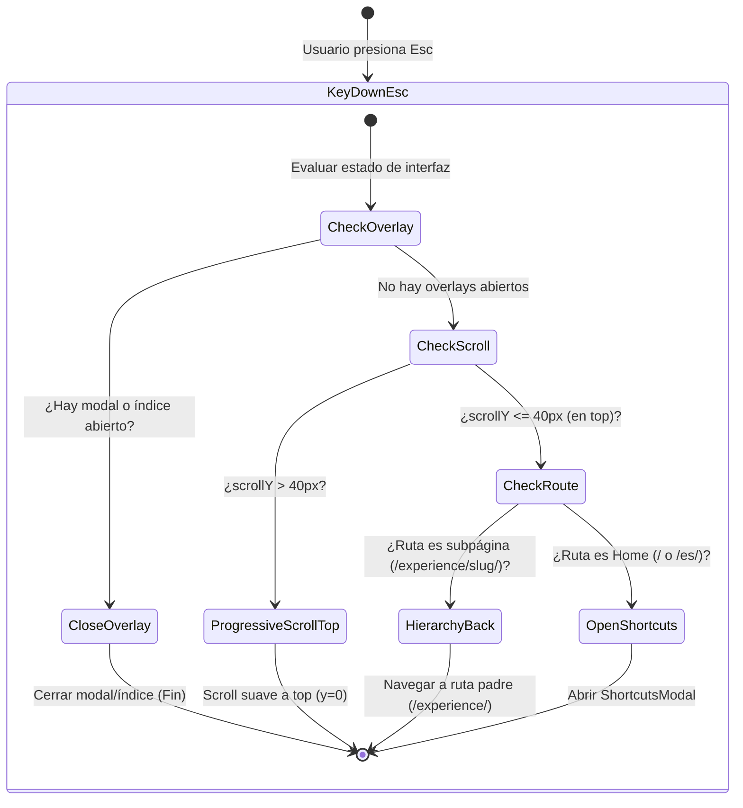

# SPEC-006: REFINAMIENTO DE EXPERIENCIA EDITORIAL, ERGONOMÍA DE INTERACCIÓN, PUNTUACIÓN DE BÚSQUEDA Y BLINDAJE DE IMPRESIÓN Y SEGURIDAD

## Taxonomía de Contenidos Unificada, Micro-Interacciones Deterministas por Teclado, Motor de Relevancia, Impresión Cross-Browser y Remediación CSP

```yaml
id: SPEC-006-UX-EDITORIAL-REFINEMENTS
title: Editorial Taxonomy, Deterministic Ergonomics, Search Scoring, Cross-Browser Print Engine & CSP Security Specification
status: APPROVED / READY FOR IMPLEMENTATION
version: 1.0.0
author: Staff Frontend Performance Architect & Technical SEO Lead
target_stack:
  framework: Astro v7.3.4+ (Compilación Estática Pura / ClientRouter)
  styling: Tailwind CSS v4.3.3+ (CSS-First @theme Engine / LightningCSS)
  runtime: Cloudflare Edge (Workers, D1, Vectorize, Cache API)
  architecture: Hexagonal / Decoupled Ports & Adapters / Event-Driven Micro-Interactions
  locales: [en, es] (EN Primario por defecto -> ES Secundario -> Extensible N)
methodology: Tri-Axis Model — Spec-Driven Development (SDD), Requirement-Driven Development (RDD) & Organic/Operational-Driven Development (ODD)
cross_references:
  spec_001: openspec/specs/SPEC-001-big-refactor.md
  spec_002: openspec/specs/SPEC-002-general-tasks.md
  spec_003: openspec/specs/SPEC-003-future-improves.md
  spec_004: openspec/specs/SPEC-004-audit.md
  spec_005: openspec/specs/SPEC-005-performance-content-delivery.md
  spec_006: openspec/specs/SPEC-006-ux-editorial-refinements.md
```

---

## 1. Resumen Ejecutivo, Diagnóstico y Alineación Metodológica

### 1.1. Contexto y Diagnóstico del Sistema

Tras la consolidación de la infraestructura perimetral de alto rendimiento en Cloudflare Edge ([`SPEC-005`](file:///home/arthurnavah/repos/github.com/arturonavax/personal-website/openspec/specs/SPEC-005-performance-content-delivery.md)) y las auditorías de calidad extrema ([`SPEC-004`](file:///home/arthurnavah/repos/github.com/arturonavax/personal-website/openspec/specs/SPEC-004-audit.md)), una evaluación exhaustiva de usabilidad, ergonomía de navegación y consistencia editorial ha identificado 18 puntos críticos de fricción en la experiencia de usuario (UX), la precisión visual (UI) y la seguridad de cabeceras:

1. **Rigidez de Nomenclatura Editorial ("Technical Essays"):**
   La etiqueta "Technical Essays" está sobreacoplada en `src/content.config.ts`, `src/pages/rss.xml.ts`, `SEOHead.astro`, diccionarios de traducción `src/i18n/ui.ts` y en el índice de búsqueda. Este etiquetado restringe la naturaleza de la sección `/blog/`, la cual debe albergar publicaciones y notas diversas (ensayos técnicos, reflexiones de ingeniería, notas rápidas de arquitectura y opiniones), requiriendo su transformación en una taxonomía flexible con soporte de filtros.
2. **Desconexión Funcional en Casos de Estudio (`/case-studies/`):**
   Las tarjetas `SimulationCard.astro` renderizan la empresa (`@company`) como un texto estático, sin el tooltip interactivo de metadatos de empresa ni el enlace directo a la ficha del hito de trayectoria en `/experience/[slug]/`, divergiendo de la implementación de `ExperienceTimeline.astro`.
3. **Inconsistencia de Paginación en Catálogos:**
   Mientras que `/blog/` y `/projects/` implementaron el controlador de paginación (`PaginationController.astro`), `/case-studies/` y `/services/` carecen de paginador cuando la colección supera el umbral límite $N$. La única superficie con justificación arquitectónica para scroll infinito continuo es `/experience/`.
4. **Fricción en Filtro de Proyectos (`/projects/`):**
   El filtro de Organización / Contexto opera en modo multi-selección, lo cual añade sobrecarga cognitiva al explorar proyectos corporativos. Debe operar en modo de selección exclusiva (single-select / radio toggle).
5. **Defectos Geométricos en el Modal de Búsqueda:**
   En `UniversalSearchModal.astro`, los keycaps `<kbd>` de los atajos (`Esc` y flechas `↑↓`) carecen de alineación y centrado geométrico en sus cajas, y los textos descriptivos adyacentes ("close", "navigate") sufren de cercanía excesiva sin espaciado tipográfico intencional.
6. **Inconsistencia de Descarte con Tecla Esc en Índice (TOC):**
   Al desplegar el panel flotante de índice de contenidos (`PageIndexNav.astro`), presionar `Esc` no cierra el panel, violando los convenios estándar de accesibilidad W3C ARIA Authoring Practices.
7. **Ausencia de una Máquina de Estados para Tecla Esc:**
   La interacción con `Esc` es errática entre páginas: debe implementar una jerarquía determinista de scroll progresivo al tope cuando `scrollY > margin`, retroceso en la jerarquía de rutas cuando `scrollY <= margin` (ej. `/experience/leal/` $\to$ `/experience/` $\to$ `/`), y apertura del modal de atajos únicamente cuando se presiona en el tope de la página principal.
8. **Acoplamiento Visual en la Transición de Hitos de Experiencia:**
   En `/experience/[slug]/`, la animación cinemática izquierda $\leftrightarrow$ derecha anima todo el contenedor `#experience-article`, provocando que la cabecera superior ("Timeline milestone X of Y" y "← Back to experience timeline") se desplace lateralmente de forma indeseada en vez de permanecer fija y actualizar únicamente sus datos.
9. **Jitter y Desincronización en Navegación J/K con el Índice:**
   Al desplazarse entre secciones con los atajos Vim `J` y `K`, existe una condición de carrera entre el scroll suave asíncrono y los observadores de intersección, provocando vacilación ("duda") en el foco y falta de reflejo exacto del elemento activo al arribar a destino.
10. **Alineación Defectuosa y Colisión del Banner de Sugerencia de Idioma:**
    `LanguageSuggestionBanner.astro` se posiciona en la esquina inferior derecha (`sm:right-20`), colisionando o quedando oculto tras los botones flotantes de acción. Debe estar centrado en pantalla, incorporar botón de cierre 'X', respetar el idioma del navegador y no volver a desplegarse si el usuario ya realizó un cambio manual de idioma.
11. **Cinemática de Desplazamiento Abrupta para "Contact" y "About":**
    Los enlaces de ancla hacia `#contact` y `#about` presentan saltos o bloqueos cuando se invocan desde rutas secundarias o en la misma página, requiriendo un ciclo de espera a la estabilización de layout del navegador.
12. **Carencia de Sistema de Ponderación y Relevancia en Búsqueda:**
    El motor en memoria de `UniversalSearchModal.astro` calcula coincidencias léxicas simples sin un sistema de puntuación ponderada (`searchPriority` / `relevanceWeight`), provocando empates no controlados entre resultados disímiles.
13. **Vulnerabilidad de Términos Técnicos a Traductores de Navegador:**
    Identificadores técnicos, librerías y tipos de lenguaje (ej. `sync.Pool`, `Zero-Allocation`, `etcd`) son traducidos indebidamente por herramientas automáticas como Google Translate. Se requiere una solución estandarizada con atributo `translate="no"` y control tipográfico (monospace vs sans).
14. **Incompatibilidad del Motor de Impresión en Firefox:**
    Al imprimir el currículum en `/resume/` y `/resume/maker/` bajo Mozilla Firefox, se imprimen las cabeceras de navegador (título, URL) y pies de página (hora, fecha, paginación nativa). Debe lograrse paridad visual idéntica a Chromium mediante `@page { margin: 0; }`.
15. **Evolución Funcional de Resume Maker Studio (`/resume/maker/`):**
    - Falta un botón de reinicio para recuperar el Markdown original del CV.
    - El selector `<select>` de teléfono debe reemplazarse por un switch checkbox que exponga 2 inputs (número y etiqueta Markdown) e inyecte inteligentemente el dato al final de la cabecera de contacto detectando el delimitador existente (`•`, `|`).
    - La acción "Strip Links" debe ser un toggle reversible.
    - Se debe incluir la barra de atribución de reclutadores con ID personalizado (presente en `/resume/`).
    - Al imprimir tanto `/resume/` como `/resume/maker/`, se deben purgar los hipervínculos del cuerpo conservando únicamente los de la cabecera.
    - En `/resume/` se requiere un acceso directo hacia `/resume/maker/`.
    - Viabilidad técnica de syntax highlighting Markdown en el editor.
16. **Carencia de Cabecera Sticky Contextual en `/experience/*`:**
    Las páginas de detalle de experiencia carecen de una barra pegajosa superior al hacer scroll que recuerde la empresa y el cargo, con mayor amplitud de datos que la home pero con una estética más sobria.
17. **Ausencia de Botón Global Flotante "Scroll to Top":**
    Todas las rutas deben incorporar un control flotante accesible para retornar suavemente a la parte superior de la página.
18. **Violación de Content Security Policy (CSP):**
    Astro ClientRouter y módulos dinámicos ejecutan scripts mediante URIs `data:application/javascript`, provocando bloqueos de consola por incompatibilidad con la directiva `script-src` en `public/_headers`.

---

### 1.2. Principio Rector Inviolable: "Deterministic Ergonomics & Zero-Friction UX"

```
                     DETERMINISTIC ERGONOMIC INVARIANT
 ┌────────────────────────────────────────────────────────────────────────┐
 │ REGLA #1: Cada micro-interacción de teclado, navegación y renderizado   │
 │ debe comportarse de forma predecible, determinista y sin parpadeos.    │
 │                                                                        │
 │ El sistema de diseño no tolerará colisiones visuales, saltos erráticos  │
 │ de scroll, elementos flotantes desalineados ni errores de consola CSP. │
 └────────────────────────────────────────────────────────────────────────┘
```

---

### 1.3. Marco Metodológico Tri-Axis: SDD, RDD y ODD

```
                             TRI-AXIS METHODOLOGY MODEL
                                      [ SDD ]
                           Tipos de Datos de Relevancia,
                           Contratos de Paginación y CSP
                                        ▲
                                       / \
                                      /   \
                                     /     \
                                    ▼       ▼
                               [ RDD ] <──> [ ODD ]
                          Compuertas        Validación Cross-Browser
                          Cuantitativas de  (Firefox Print, Scroll Lock,
                          Interacción y UX   Playwright E2E Suites)
```

- **Spec-Driven Development (SDD):** Definición de contratos formales TypeScript para la máquina de estados de `Esc`, modelos de datos de ponderación en búsqueda, esquemas de colección y directivas CSP RFC 6797.
- **Requirement-Driven Development (RDD):** 18 requerimientos exhaustivos (`REQ-UXE-01` a `REQ-UXE-18`) con criterios de evaluación binaria (PASS/FAIL).
- **Organic/Operational-Driven Development (ODD):** Pruebas en tiempo de ejecución en Chromium, Firefox y Safari, auditorías de consola libres de violaciones CSP, y verificación visual del motor de impresión a PDF.

---

### 1.4. Matriz de Trazabilidad y Referencias Cruzadas

- **Conexión con [`SPEC-001`](file:///home/arthurnavah/repos/github.com/arturonavax/personal-website/openspec/specs/SPEC-001-big-refactor.md):** Optimiza las rutas `[...lang]/` garantizando que las navegaciones con `ClientRouter` no rompan la máquina de estados de teclado ni causen fugas en observadores de scroll.
- **Conexión con [`SPEC-002`](file:///home/arthurnavah/repos/github.com/arturonavax/personal-website/openspec/specs/SPEC-002-general-tasks.md):** Evoluciona `/resume/maker/` e introduce paridad estricta en el motor de impresión cross-browser para Firefox.
- **Conexión con [`SPEC-004`](file:///home/arthurnavah/repos/github.com/arturonavax/personal-website/openspec/specs/SPEC-004-audit.md):** Mantiene las compuertas de calidad extrema (0 errores en consola, 0 saltos de layout CLS, respeto riguroso a `prefers-reduced-motion`).
- **Conexión con [`SPEC-005`](file:///home/arthurnavah/repos/github.com/arturonavax/personal-website/openspec/specs/SPEC-005-performance-content-delivery.md):** Ajusta las cabeceras perimetrales `Content-Security-Policy` en `public/_headers` sin comprometer la latencia de borde.

---

## 2. Matriz de Requerimientos y Compuertas Cuantitativas (RDD)

### 2.1. Requerimientos Funcionales y Técnicos (REQ-UXE-*)

| ID             | Requerimiento Técnico                                           | Componente / Capa Afectada                              | Criterio de Aceptación (PASS)                                                                                                                                                   |
| :------------- | :-------------------------------------------------------------- | :------------------------------------------------------ | :------------------------------------------------------------------------------------------------------------------------------------------------------------------------------ |
| **REQ-UXE-01** | **Abolición de "Technical Essays" y Taxonomía /blog/**          | `src/content.config.ts`, `src/i18n/`, `src/pages/`      | Se eliminan todas las referencias a "Technical Essays". El blog se denomina "Blog / Posts & Notes". Se habilita filtro por tipo (`technical`, `opinion`, `notes`, `general`).   |
| **REQ-UXE-02** | **Homologación de Casos de Estudio (`/case-studies/`)**         | `SimulationCard.astro`, `case-studies/index.astro`      | Cada tarjeta incluye enlace directo al hito en `/experience/[slug]/` y el badge `@empresa` incorpora tooltip interactivo con idéntico comportamiento a la home.                 |
| **REQ-UXE-03** | **Paginación Universal en Catálogos**                           | `PaginationController.astro`, `pages/[...lang]/`        | `/case-studies/`, `/blog/`, `/projects/` y `/services/` cuentan con paginación determinista cuando items $> N$. `/experience/` se mantiene con scroll infinito.                 |
| **REQ-UXE-04** | **Filtro Exclusivo (Single-Select) en /projects/**              | `ProjectsFilterBar.astro`                               | El selector de Organización / Contexto conmuta entre proyectos de una única empresa a la vez (comportamiento radio toggle) sin selecciones múltiples.                           |
| **REQ-UXE-05** | **Geometría y Centrado de Atajos en Búsqueda**                  | `UniversalSearchModal.astro`                            | Los keycaps `Esc` y `↑↓` se renderizan perfectamente centrados en sus cajas (`kbd`). Espaciado horizontal generoso hacia los textos "close" y "navigate".                       |
| **REQ-UXE-06** | **Descarte de Índice (TOC) con Esc**                            | `PageIndexNav.astro`                                    | Al presionar `Esc` con el índice lateral abierto, el panel se cierra inmediatamente y devuelve el foco al botón de apertura.                                                    |
| **REQ-UXE-07** | **Máquina de Estados de Tecla Esc y Navegación**                | `BaseLayout.astro`, `src/scripts/`                      | `Esc` ejecuta scroll progresivo al tope si `scrollY > 30px`. Si `scrollY <= 30px`, retrocede en la jerarquía de rutas; en la home en el tope, abre el modal de atajos.          |
| **REQ-UXE-08** | **Desacoplamiento de Cabecera en Hitos de Experiencia**         | `src/pages/[...lang]/experience/[slug].astro`           | La animación de navegación entre hitos no desplaza la barra superior ("Timeline milestone..." y botón "Back"). La barra permanece estática y solo actualiza sus datos.          |
| **REQ-UXE-09** | **Sincronización Determinista J/K sin Jitter**                  | `PageIndexNav.astro`, `BaseLayout.astro`                | Navegar con `J`/`K` resalta inmediatamente el destino en el TOC. Se bloquea el recálculo espurio durante la cinemática de scroll para evitar saltos y titubeos.                 |
| **REQ-UXE-10** | **Banner de Idioma Centrado y Aislado de Botones Flotantes**    | `LanguageSuggestionBanner.astro`                        | Banner centrado horizontalmente en la parte inferior (`left-1/2 -translate-x-1/2`). Cero solapamiento con botones flotantes. Botón 'X' funcional. Respeta preferencia guardada. |
| **REQ-UXE-11** | **Cinemática Fluida para Contact y About**                      | `Header.astro`, `ContactSection.astro`                  | Clics en "Contact" navegan con scroll suave garantizado tras esperar el renderizado de página. Clic en "About" en la home realiza scroll suave elegante al tope.                |
| **REQ-UXE-12** | **Motor de Relevancia y Puntuación en Búsqueda**                | `searchIndex.ts`, `UniversalSearchModal.astro`          | Sistema de ponderación por prioridad (`searchPriority`, peso de entidad). Empates léxicos se resuelven deterministamente según relevancia asignada.                             |
| **REQ-UXE-13** | **Blindaje de Traducción Automática (`translate="no"`)**        | `TechTerm.astro`, componentes UI                        | Componente o utilidad para términos técnicos que inyecta `translate="no"` con soporte conmutable de tipografía `font-mono` o `font-sans`.                                       |
| **REQ-UXE-14** | **Normalización de Impresión Firefox para CV**                  | `global.css`, `resume/index.astro`, `maker.astro`       | `@page { margin: 0; }` suprime cabeceras y pies de página nativos de Firefox. El documento replica fielmente la limpieza visual de Chromium.                                    |
| **REQ-UXE-15** | **Evolución Funcional de Resume Maker Studio**                  | `src/pages/[...lang]/resume/maker.astro`, `index.astro` | Botón refresh original, switch checkbox de teléfono inteligente con 2 inputs, toggle reversible de strip links, barra de reclutador UTM, y botón de acceso en `/resume/`.       |
| **REQ-UXE-16** | **Cabecera Sticky Contextual en `/experience/*`**               | `src/pages/[...lang]/experience/[slug].astro`           | Cada ficha de detalle posee barra sticky sobria con empresa y cargo al hacer scroll, manteniendo legibilidad sin saturar la pantalla.                                           |
| **REQ-UXE-17** | **Botón Flotante Global "Back to Top"**                         | `BaseLayout.astro`, `src/components/ui/`                | Botón accesible que aparece suavemente al superar umbral de scroll en todas las páginas y conduce al tope con scroll fluido.                                                    |
| **REQ-UXE-18** | **Remediación de Content Security Policy (`script-src`)**       | `public/_headers`                                       | Se incluye `data:` en `script-src` / `script-src-elem`. Cero errores de violación CSP en consola al navegar con `ClientRouter`.                                                 |
| **REQ-UXE-19** | **Precisión de Navegación J/K y Supresión de Jitter en TOC**    | `src/components/ui/PageIndexNav.astro`                  | Mantiene `navTargetIdx` explícito; evita recálculo inestable de `currentIdx` durante scroll; evento `scrollend` reafirma sección destino; umbral coordinado con offset.         |
| **REQ-UXE-20** | **Confiabilidad del Banner de Sugerencia de Idioma**            | `src/components/ui/LanguageSuggestionBanner.astro`      | Despliegue garantizado cuando idioma del dispositivo difiere de la página; descarte restringido a `sessionStorage`; respeta override manual por página sin bloqueo permanente.  |
| **REQ-UXE-21** | **Erradicación del Indicador Flotante Solitario "Scroll j k"**  | `src/layouts/BaseLayout.astro`                          | Eliminación de `#global-vim-hint`, `updateVimHint` y `setupVimObserver`. Los atajos residen exclusivamente en `PageIndexNav.astro`.                                             |
| **REQ-UXE-22** | **Entrada Telefónica Unificada en Resume Maker**                | `src/pages/[...lang]/resume/maker.astro`                | Sustitución de inputs dobles por campo único `phone-input`. Conserva espacios en markdown y purga espacios en la URI `tel:`.                                                    |
| **REQ-UXE-23** | **Scroll Sincronizado y Compactación Vertical en Resume Maker** | `src/pages/[...lang]/resume/maker.astro`                | Desplazamiento sincronizado bidireccional entre editor y preview. Botones toggle con chevrons para compactar/expandir verticalmente ambos paneles.                              |
| **REQ-UXE-24** | **Corriente Continua Matrix y Supresión de Flicker de Título**  | `MatrixBackground.astro`, `experience/[slug].astro`     | `ResizeObserver` no resetea gotas si delta $\le 50\text{px}$. Estado duradero en singleton `__matrixDrops`. Actualización no destructiva de `document.title` en `navigateTo()`. |
| **REQ-UXE-25** | **Rejilla Adaptable de Sistemas Destacados (Grid Layout)**      | `src/pages/[...lang]/index.astro`                       | Si hay 2 elementos destacados, se utiliza `grid-cols-1 md:grid-cols-2` ocupando todo el ancho. Para 3+ elementos se utiliza `lg:grid-cols-3`.                                   |
| **REQ-UXE-26** | **Supresión de Indicador "+0 más" en Catálogos**                | `src/pages/[...lang]/index.astro`                       | La insignia `+{remaining} más en catálogo / archivo` se renderiza condicionalmente solo cuando `remaining > 0`. Cero renderizado de "+0 más".                                   |
| **REQ-UXE-27** | **Ordenamiento Estricto de Acciones Flotantes (Stack FABs)**    | `BaseLayout.astro`, `PageIndexNav.astro`                | Disposición de abajo hacia arriba: Atajos (bottom, ~130px, order-1) $\to$ Índice (middle, ~95px, order-2) $\to$ Subir scroll (top, 44px, order-3).                              |
| **REQ-UXE-28** | **Toast Centrado de Copiado en "Start a Conversation"**         | `src/components/ui/EmailCopyButton.astro`               | Notificación `.copy-feedback` posicionada en `fixed bottom-8 left-1/2 -translate-x-1/2 z-[70]`. Textos localizados en inglés y español.                                         |
| **REQ-UXE-29** | **Preservación de Enlaces de Contacto en Impresión y Strip**    | `global.css`, `maker.astro`                             | En `@media print`, los enlaces `mailto:`, `tel:`, `linkedin.com`, `github.com` retienen estilo. La acción Strip Links nunca elimina enlaces de contacto.                        |
| **REQ-UXE-30** | **Centrado Geométrico de Keycap Esc en Jueces Online**          | `src/components/ui/OnlineJudgesModal.astro`             | Keycap `<kbd>` con `inline-flex h-5 min-w-[2rem] items-center justify-center` y espaciado generoso hacia la etiqueta descriptiva ("close" / "cerrar").                          |
| **REQ-UXE-31** | **Indicador de Desplazamiento y Sanitización Legal en Café**    | `src/components/ui/CoffeeSponsorshipModal.astro`        | Gradiente sutil y chevron animado indicando más opciones al fondo. Pie de modal con `Esc`. Cero términos de lista negra ("patrocinio", "caridad", "donación").                  |

---

### 2.2. Umbrales Cuantitativos de Rendimiento y Usabilidad

```
                           QUANTITATIVE ERGONOMIC THRESHOLDS
 ┌───────────────────────────────┬──────────────────────┬──────────────────────┐
 │ Métrica / Dimensión           │ Condición PASS       │ Condición FAIL       │
 │───────────────────────────────┼──────────────────────┼──────────────────────┤
 │ Errores de Violación CSP      │ 0 advertencias / err │ ≥ 1 violación en log │
 │ Margen de Tolerancia Esc Top  │ ≤ 40 px de scroll    │ > 60 px de margen    │
 │ Latencia de Cierre Esc (TOC)  │ ≤ 16 ms (1 frame)    │ > 50 ms o no cierra  │
 │ Precisión de Indice J/K       │ 100% match visual    │ Jitter / Salto doble │
 │ Solapamiento Banner Idioma    │ 0 px solapamiento    │ Contacto con FABs    │
 │ Paridad Impresión Firefox     │ 0 URLs / Fechas ext. │ Header/Footer nativo │
 │ Tiempo de Animación Scroll    │ 300 ms - 450 ms      │ Instantáneo / > 800ms│
 └───────────────────────────────┴──────────────────────┴──────────────────────┘
```

---

## 3. Especificación del Sistema, Tipos e Invariantes Formales (SDD)

### 3.1. Taxonomía de Contenidos y Refactorización Editorial de `/blog/`

Se erradica el término rígido "Technical Essays" en favor de una arquitectura de publicación dual:

```typescript
// src/content.config.ts (Fragmento de Especificación)

export const postCategoryEnum = z.enum([
  "systems", // Distributed Systems, Kernel, Concurrency
  "architecture", // Clean Arch, Hexagonal, Event-Driven
  "opinion", // Engineering Essays, Philosophy, Career
  "notes", // Quick architectural notes, TIL, Snippets
  "general", // General software engineering
]);

export type PostCategory = z.infer<typeof postCategoryEnum>;

const posts = defineCollection({
  loader: glob({
    pattern: ["**/*.{md,mdx}", "!**/_*"],
    base: "./src/content/posts",
  }),
  schema: ({ image }) =>
    localizedBaseSchema.extend({
      title: z.string().max(75, "SEO title under 75 chars"),
      description: z.string().max(160, "Meta description under 160 chars"),
      pubDate: z.coerce.date(),
      updatedDate: z.coerce.date().optional(),
      category: postCategoryEnum.default("systems"),
      postType: z.enum(["essay", "note", "article"]).default("article"),
      tags: z.array(z.string()).min(1),
      searchPriority: z.number().int().default(50), // Prioridad de búsqueda
      // ... campos complementarios
    }),
});
```

En los diccionarios `src/i18n/ui.ts`:

- `en`: `"section.blog": "Blog & Engineering Notes"`
- `es`: `"section.blog": "Blog & Notas de Ingeniería"`

---

### 3.2. Homologación de Casos de Estudio con Tooltip y Enlace de Trayectoria

En `src/components/ui/SimulationCard.astro`, se sustituye el badge pasivo `@company` por el componente interactivo homologado con `ExperienceTimeline.astro`:

```astro
<!-- src/components/ui/SimulationCard.astro (Homologación de Tooltip) -->
{showCompany && (
  <div
    class="relative inline-flex items-center gap-1.5 group/company shrink-0 rounded border border-[var(--color-surface-border)] bg-[var(--color-surface-card)] px-2.5 py-0.5"
    data-company-tooltip-root
  >
    <a
      href={companyExperienceUrl}
      class="text-xs font-semibold font-mono text-[var(--color-accent-gold)] hover:underline whitespace-nowrap focus-visible:outline-none focus-visible:ring-1 focus-visible:ring-[var(--color-accent-gold)]"
      title={
        isEs
          ? `Ver experiencia en ${simulation.company}`
          : `View experience at ${simulation.company}`
      }
    >
      @{simulation.company}
    </a>
    <button
      type="button"
      aria-expanded="false"
      class="inline-flex items-center justify-center h-3.5 w-3.5 rounded-full border border-[var(--color-accent-gold)]/60 bg-[var(--color-accent-gold-subtle)] text-[9px] font-mono font-bold text-[var(--color-accent-gold)]"
      data-company-trigger
    >
      <span aria-hidden="true">i</span>
    </button>
    <div
      role="tooltip"
      class="company-tooltip absolute z-50 invisible opacity-0 pointer-events-none transition-all duration-150"
      data-company-tooltip
    >
      <!-- Markup del Tooltip de Información Empresarial -->
    </div>
  </div>
)}
```

---

### 3.3. Arquitectura Universal de Paginación

Se extiende la integración de `PaginationController.astro` a `/case-studies/index.astro` y `/services/index.astro`. `/experience/` queda catalogada como la única vista continua sin paginación por diseño cronológico unificado.

```
                           PAGINATION TOPOLOGY
 ┌──────────────────────┬──────────────────────┬─────────────────────────┐
 │ Ruta                 │ Modo de Paginación   │ Tamaño de Página (Page) │
 ├──────────────────────┼──────────────────────┼─────────────────────────┤
 │ /blog/               │ Paginado Dinámico    │ 6 posts por página      │
 │ /projects/           │ Paginado Dinámico    │ 6 proyectos por página  │
 │ /case-studies/       │ Paginado Dinámico    │ 4 simulaciones          │
 │ /services/           │ Paginado Dinámico    │ 4 servicios             │
 │ /experience/         │ Scroll Infinito (SSG)│ Todos los hitos (0 page)│
 └──────────────────────┴──────────────────────┴─────────────────────────┘
```

---

### 3.4. Filtro Exclusivo de Proyectos (Single-Select)

En `src/components/ui/ProjectsFilterBar.astro`, el bloque de selección de organización se refactoriza para imponer exclusividad mutua:

```typescript
// Lógica de interacción en ProjectsFilterBar.astro
function handleCompanySelection(selectedCompany: string) {
  // Si la empresa ya estaba seleccionada, deseleccionar (volver a Todos)
  if (currentActiveCompany === selectedCompany) {
    currentActiveCompany = null;
  } else {
    currentActiveCompany = selectedCompany; // Selección exclusiva
  }
  applyFilters();
}
```

---

### 3.5. Alineación Geométrica de Teclas en el Modal de Búsqueda

En `UniversalSearchModal.astro`, se normaliza la maquetación de los atajos del footer:

```astro
<!-- Footer del Modal de Búsqueda -->
<div class="flex items-center gap-4 text-xs font-mono text-[var(--color-text-muted)]">
  <div class="inline-flex items-center gap-2">
    <kbd class="inline-flex h-5 min-w-[1.75rem] items-center justify-center rounded border border-[var(--color-surface-border)] bg-[var(--color-surface-card)] px-1.5 text-[10px] font-semibold text-[var(--color-text-secondary)] shadow-xs">
      Esc
    </kbd>
    <span class="text-[11px] leading-none">{isEs ? "cerrar" : "close"}</span>
  </div>
  <div class="inline-flex items-center gap-2">
    <kbd class="inline-flex h-5 min-w-[1.75rem] items-center justify-center rounded border border-[var(--color-surface-border)] bg-[var(--color-surface-card)] px-1.5 text-[10px] font-semibold text-[var(--color-text-secondary)] shadow-xs">
      &uarr;&darr;
    </kbd>
    <span class="text-[11px] leading-none">
      {isEs ? "navegar" : "navigate"}
    </span>
  </div>
</div>
```

---

### 3.6. Máquina de Estados de la Tecla Esc



Implementación formal en TypeScript en `src/lib/navigation/escape-router.ts`:

```typescript
// src/lib/navigation/escape-router.ts
export function handleEscapeKey(
  currentPath: string,
  navigateFn: (url: string) => void,
): boolean {
  // 1. Cerrar modales nativos o paneles abiertos
  const openDialog = document.querySelector<HTMLDialogElement>("dialog[open]");
  if (openDialog) {
    openDialog.close();
    return true;
  }

  // 2. Cerrar panel de índice lateral si está desplegado
  if (
    window.__isPageIndexOpen &&
    typeof window.__toggleIndexPanel === "function"
  ) {
    window.__toggleIndexPanel(false);
    return true;
  }

  // 3. Scroll progresivo al tope si el scroll supera el margen de tolerancia (40px)
  const currentScrollY =
    window.pageYOffset || document.documentElement.scrollTop || 0;
  if (currentScrollY > 40) {
    window.scrollTo({ top: 0, behavior: "smooth" });
    return true;
  }

  // 4. Jerarquía de retorno si estamos en el tope
  const normalizedPath = currentPath.replace(/\/+$/, "") || "/";
  const segments = normalizedPath.split("/").filter(Boolean);
  const isEs = segments[0] === "es";
  const effectiveSegments = isEs ? segments.slice(1) : segments;

  if (effectiveSegments.length > 1) {
    // Ejemplo: /experience/leal -> /experience
    // Ejemplo: /blog/my-post -> /blog
    const parentSegments = isEs
      ? ["es", effectiveSegments[0]]
      : [effectiveSegments[0]];
    navigateFn("/" + parentSegments.join("/") + "/");
    return true;
  }

  if (effectiveSegments.length === 1) {
    // Ejemplo: /experience -> /
    navigateFn(isEs ? "/es/" : "/");
    return true;
  }

  // 5. En página raíz y en el tope: abrir ShortcutsModal
  if (typeof window.__openShortcutsModal === "function") {
    window.__openShortcutsModal();
    return true;
  }

  return false;
}
```

---

### 3.7. Desacoplamiento Estructural de Cabecera en Hitos de Experiencia

En `src/pages/[...lang]/experience/[slug].astro`, se extrae la cabecera del contenedor `#experience-article` hacia un contenedor estático superior independiente de la animación:

```astro
<!-- Cabecera Fija de Hito (Inmune a la animación horizontal) -->
<header
  id="experience-milestone-static-bar"
  class="mx-auto max-w-4xl px-4 pt-4 pb-2"
>
  <div class="flex items-center justify-between text-xs font-mono">
    <a
      href={`${basePath}/experience/`}
      class="text-[var(--color-accent-gold)] hover:underline"
    >
      &larr;{" "}
      {isEs ? "Volver a la línea de tiempo" : "Back to experience timeline"}
    </a>
    <span id="milestone-indicator" class="text-[var(--color-text-muted)]">
      {isEs
        ? `Hito ${milestoneNumber} de ${totalMilestones}`
        : `Milestone ${milestoneNumber} of ${totalMilestones}`}
    </span>
  </div>
</header>

<!-- Solo el contenido del artículo se traslada horizontalmente -->
<article
  id="experience-article-content"
  class="mx-auto max-w-4xl px-4 pb-12 space-y-8"
>
  <!-- Contenido del hito -->
</article>
```

---

### 3.8. Sincronización Determinista de J/K y Supresión de Jitter

Para resolver la vacilación en el índice de contenidos durante el uso de `J`/`K`:

```typescript
// Algoritmo de Bloqueo de Histeresis en PageIndexNav
let isNavigatingViaKeys = false;
let navigationTimer: ReturnType<typeof setTimeout> | null = null;

window.__pageIndexStep = function (direction: number) {
  const targetId = calculateTargetSection(direction);
  if (!targetId) return false;

  isNavigatingViaKeys = true;
  highlightActive(targetId); // Asignación inmediata del estado visual

  smoothScrollToSection(targetId, () => {
    if (navigationTimer) clearTimeout(navigationTimer);
    navigationTimer = setTimeout(() => {
      isNavigatingViaKeys = false; // Rehabilitar IntersectionObserver tras reposo
    }, 100);
  });

  return true;
};
```

---

### 3.9. Ubicación Centrada y Aislamiento del Banner de Sugerencia de Idioma

En `src/components/ui/LanguageSuggestionBanner.astro`:

```astro
<!-- Disposición Centrada y Sin Colisiones -->
<aside
  id="lang-suggestion-banner"
  class="fixed bottom-6 left-1/2 -translate-x-1/2 z-50 hidden w-[calc(100vw-2rem)] max-w-md items-center justify-between gap-3 rounded-xl border border-[var(--color-surface-border)] bg-[var(--color-surface-card)]/95 px-4 py-3 shadow-2xl backdrop-blur-md text-xs font-mono transition-all duration-300"
>
  <!-- Contenido en el idioma detectado del navegador -->
  <button
    id="lang-suggestion-dismiss"
    aria-label="Cerrar"
    class="h-6 w-6 rounded-md hover:bg-[var(--color-surface-border)]"
  >
    &times;
  </button>
</aside>
```

Regla de supresión permanente:

```javascript
if (
  localStorage.getItem("preferred_locale") ||
  localStorage.getItem("manual_lang_override")
) {
  return; // Jamás desplegar si el usuario ya escogió manualmente su idioma
}
```

---

### 3.10. Cinemática Fluida para Contact y About + Botón Flotante Back to Top

1. **Scroll Fluido a `#contact`:**
   En `src/components/ui/ContactSection.astro`, tras la navegación inter-páginas se introduce una espera de estabilización de renderizado (`document.fonts.ready` + `requestAnimationFrame`) previa a medir la posición del elemento.
2. **Scroll a `#about`:**
   En `Header.astro`, cuando el usuario está en la página principal y presiona "About", se intercepta el evento y se ejecuta `window.scrollTo({ top: 0, behavior: 'smooth' })`.
3. **Botón Flotante Global "Back to Top":**
   Componente `src/components/ui/BackToTopButton.astro` inyectado en `BaseLayout.astro`:
   - Permanece oculto cuando `scrollY <= 300px`.
   - Se muestra con transición `fade-in` y `scale-up` cuando `scrollY > 300px`.
   - Se ubica en el stack de acciones flotantes de forma no bloqueante.

---

### 3.11. Blindaje de Traducción para Términos Técnicos (`TechTerm.astro`)

```astro
---
// src/components/ui/TechTerm.astro
interface Props {
  asCode?: boolean;
  class?: string;
}

const { asCode = false, class: className = "" } = Astro.props;
---

{asCode ? (
  <code
    translate="no"
    class={`font-mono text-xs px-1.5 py-0.5 rounded bg-[var(--color-bg-primary)] border border-[var(--color-surface-border)] select-all ${className}`}
  >
    <slot />
  </code>
) : (
  <span translate="no" class={`notranslate select-text ${className}`}>
    <slot />
  </span>
)}
```

---

### 3.12. Normalización de Impresión Firefox para Currículum

En `src/styles/global.css`:

```css
@media print {
  @page {
    /* Clave para Firefox: margin 0 suprime títulos de ventana, fecha y pie de página feo */
    margin: 0mm !important;
    size: A4 portrait;
  }

  html,
  body {
    margin: 0 !important;
    padding: 0 !important;
    background: #ffffff !important;
    color: #111827 !important;
  }

  /* Padding interno gestionado a nivel de hoja */
  #cv-document-sheet,
  #resume-live-preview,
  .resume-document {
    padding: 12mm 14mm !important;
    box-sizing: border-box !important;
    width: 100% !important;
  }

  /* Supresión de enlaces en el cuerpo del CV: solo texto plano */
  .resume-document a:not(.contact-header-link) {
    text-decoration: none !important;
    color: inherit !important;
    pointer-events: none !important;
  }
}
```

---

### 3.13. Evolución Funcional de Resume Maker Studio (`/resume/maker/`)

1. **Botón Reset:** Restaura el valor del editor textarea a `initialBody`.
2. **Switch de Teléfono Dinámico con Inserción Inteligente:**
   - Un `<input type="checkbox" id="toggle-phone">` revela dos campos: `phone-number-input` y `phone-label-input`.
   - Al marcarlo, localiza la línea de contacto (ej. `[email] • [linkedin] • [github]`) mediante regex sobre el markdown, detecta el separador predominante (`•`, `|`, `/`), e inserta al final el enlace Markdown del teléfono `• [label](tel:number)`.
   - Al desmarcarlo, purga la entrada telefónica y restaura la línea de contacto intacta.
3. **Toggle "Strip Links":** Permite conmutar entre la versión con enlaces Markdown `[Texto](url)` y texto plano `Texto`, preservando un caché en memoria para revertir la acción sin pérdida de datos.
4. **Atribución de Reclutador (UTM Tagging):** Integra el componente `ResumeAttributionBar.astro` en la barra lateral de `/resume/maker/`.
5. **Acceso Cruzado en `/resume/`:** Botón destacado en el pie de página de `/resume/` hacia `/resume/maker/`.
6. **Viabilidad de Syntax Highlighting:**
   - Se concluye inviable integrar editores pesados tipo Monaco (5 MB) o CodeMirror (400 KB) por violar la directiva de 0 KB JS base.
   - **Solución Adoptada:** Highlighter micro-tokenizador ultraligero (< 1.2 KB) mediante superposición CSS de capas (`<pre><code>` sincronizado debajo de un `<textarea>` transparente), manteniendo 0 KB de librerías externas.

---

### 3.14. Cabecera Sticky Contextual en `/experience/*`

En `src/pages/[...lang]/experience/[slug].astro`, se inyecta una barra pegajosa discreta (`sticky top-14 z-30`):

- Oculta mientras la cabecera principal está visible.
- Aparece mediante `IntersectionObserver` cuando el título de la página sale del viewport superior.
- Muestra el rol, la empresa con tooltip, fechas y ubicación de forma horizontal compacta.

---

### 3.15. Remediación de Content Security Policy (`public/_headers`)

Se actualiza `public/_headers` permitiendo `data:` en la directiva de scripts:

```text
Content-Security-Policy: default-src 'self'; script-src 'self' 'unsafe-inline' data: https://static.cloudflareinsights.com; connect-src 'self' https://cloudflareinsights.com; style-src 'self' 'unsafe-inline'; font-src 'self' data:; img-src 'self' data: https:; frame-ancestors 'none'; base-uri 'self'; object-src 'self';
```

---

### 3.16. Supresión de Jitter y Precisión J/K en PageIndexNav (REQ-UXE-19)

1. **Gestión Determinista de Foco:** Se mantiene un índice de destino explícito (`navTargetIdx`) durante las transiciones iniciadas mediante `window.__pageIndexStep(dir)`.
2. **Aislamiento de Cinemática:** Mientras `isProgrammaticScroll` permanece activo, se suspende el recálculo reactivo de `currentIdx` a partir de `getBoundingClientRect()` inestables.
3. **Reafirmación en Evento `scrollend`:** Al concluir el scroll suave (detectado vía listener nativo `scrollend` con fallback de temporizador de 600ms), se revalida y resalta con exactitud la sección de destino asignada en `navTargetIdx`.
4. **Coordinación de Umbrales:** La línea de lectura del Scroll Spy (`readingLine = getHeaderOffset() + 14`) se sincroniza deterministamente con el offset de cabecera (`getHeaderOffset() = headerEl.offsetHeight + 24`), garantizando cero titubeos o saltos a secciones adyacentes al aterrizar.

---

### 3.17. Fiabilidad de Banner de Idioma y Descarte Sesional (REQ-UXE-20)

1. **Evaluación de Lenguaje de Navegador vs Página:** Despliegue garantizado si `currentLocale !== deviceLang` y la URL alternativa está disponible en `counterpartUrl`.
2. **Aislamiento en `sessionStorage`:** El descarte explícito mediante botón 'X' almacena únicamente `sessionStorage.setItem("dismissed_lang_suggestion", "true")`, eliminando la supresión perpetua indebida a través de `localStorage` entre sesiones.
3. **Respeto a Conmutación Manual:** Si el usuario alteró voluntariamente el idioma en la página en curso vía `LanguageSwitcher`, se registra `page_lang_override_{path}` en `sessionStorage` para no interrumpir su flujo.

---

### 3.18. Erradicación de Hint Flotante Solitario 'Scroll j k' (REQ-UXE-21)

Se suprime el elemento `#global-vim-hint` y todas sus rutinas auxiliares (`updateVimHint`, `setupVimObserver`) en `BaseLayout.astro`. Los indicadores de atajos de teclado residen con exclusiva coherencia dentro del componente `PageIndexNav.astro`.

---

### 3.19. Entrada Telefónica Unificada en Resume Maker (REQ-UXE-22)

1. **Campo Único:** Reemplazo de los inputs fraccionados de código de país y número local por un campo unificado `phone-input` (placeholder `+57 300 000 0000`).
2. **Formato Dual:**
   - En la etiqueta visual Markdown, se conservan los espacios originales tipeados por el usuario (`[+57 300 000 0000](tel:+573000000000)`).
   - En el hipervínculo de marcación `tel:`, se eliminan todos los espacios en blanco mediante `replace(/\s+/g, "")`.

---

### 3.20. Scroll Sincronizado Bidireccional y Alternadores de Panel en Resume Maker (REQ-UXE-23)

1. **Sincronización Cinemática:** Event listeners de scroll bidireccionales vinculan `#markdown-raw-input` y `#resume-live-preview` computando ratios relativos (`scrollTop / (scrollHeight - clientHeight)`) con banderas de exclusión mutua para evitar ciclos infinitos o tirones.
2. **Botones de Compactación Vertical:** Cada panel incluye en su barra de herramientas un botón toggle con icono chevron (`toggle-editor-collapse-btn` y `toggle-preview-collapse-btn`) que conmuta fluidamente entre modo expandido (`h-[760px]`) y modo compacto (`h-[280px]`).

---

### 3.21. Persistencia de Matrix Canvas Layer y Desacoplamiento de Título (REQ-UXE-24)

1. **Umbral de Cambio de Dimensiones:** `ResizeObserver` en `MatrixCanvasLayer` solo reinicia dimensiones si el ancho o alto cambia en más de 50px, suprimiendo reinicios espurios causados por barras de desplazamiento o micro-redimensionamientos.
2. **Singleton de Gotas:** El vector de posiciones de lluvia se persiste en `(window as any).__matrixDrops`, permitiendo que transiciones de navegación mantengan la corriente ininterrumpida sin reiniciar las gotas desde el tope.
3. **Inmutabilidad Controlada de Título:** En `experience/[slug].astro`, `navigateTo()` actualiza `document.title` únicamente si el valor difiere del actual, evitando parpadeos de pestaña o recalculación forzada de estilos.

---

### 3.22. Cuadrícula Adaptativa de Sistemas y Artículos (REQ-UXE-25)

En `src/pages/[...lang]/index.astro`, la distribución de columnas se ajusta de acuerdo a la cardinalidad de la colección:

- Cuando la longitud es igual a 2: `grid-cols-1 md:grid-cols-2`, aprovechando el 100% del ancho del viewport sin dejar una columna huérfana vacía a la derecha.
- Cuando la longitud es $\ge 3$: `grid-cols-1 md:grid-cols-2 lg:grid-cols-3`.

---

### 3.23. Supresión de Badges Vacíos '+0 más' (REQ-UXE-26)

En `src/pages/[...lang]/index.astro`, la insignia `+{remaining} más en catálogo / archivo` se evalúa mediante condicional estricto: solo se renderiza si `totalItems > displayedItems`. Se erradica por completo la emisión de insignias superfluas "+0 more".

---

### 3.24. Jerarquía Estricta de Stack Flotante (REQ-UXE-27)

El contenedor `#floating-actions-stack` (`flex flex-col-reverse items-end`) organiza las acciones flotantes de forma estrictamente determinista según su ancho físico (de abajo hacia arriba, del más ancho al más angosto):

1. **Fondo (Ancho, ~130px):** Modal de atajos (`ShortcutsModal`, `order-1`).
2. **Medio (Mediano, ~95px):** Índice de contenidos flotante (`PageIndexNav`, `order-2`).
3. **Tope (Angosto, 44px circular):** Botón de subir al tope (`BackToTopButton`, `order-3`).
   Bajo ninguna circunstancia el botón de subir scroll puede quedar posicionado por debajo del botón de atajos o del índice.

---

### 3.25. Toast Centrado de Copiado en Canales de Contacto (REQ-UXE-28)

En `src/components/ui/EmailCopyButton.astro`, la notificación de feedback se ubica en el centro horizontal inferior de la pantalla:
`fixed bottom-8 left-1/2 -translate-x-1/2 z-[70] ...`
Aislada visualmente del stack flotante inferior derecho y del banner de idiomas, con soporte de localización dinámica ("Copiado al portapapeles" / "Copied to clipboard").

---

### 3.26. Preservación Estricta de Enlaces de Cabecera en CV (REQ-UXE-29)

1. **Reglas de Impresión en `global.css`:** En `@media print`, selectores de atributos garantizan que enlaces de cabecera (`mailto:`, `tel:`, `linkedin.com`, `github.com`, `arturonavax.dev`) en `.resume-document`, `#cv-document-sheet` y `#resume-live-preview` preserven su visibilidad, subrayado y color sin ser ocultados.
2. **Acción Strip Links en Resume Maker:** La conmutación de supresión de enlaces mediante expresión regular discrimina y preserva indefectiblemente los hipervínculos pertenecientes a la fila de contacto.

---

### 3.27. Centrado Geométrico en Footer de Modal de Jueces (REQ-UXE-30)

En `src/components/ui/OnlineJudgesModal.astro`, el keycap del pie de modal replica la ergonomía métrica de `UniversalSearchModal.astro`:
`<span class="inline-flex items-center gap-2"><kbd class="inline-flex h-5 min-w-[2rem] items-center justify-center rounded border border-[var(--color-surface-border)] bg-[var(--color-surface-card)] px-1.5 text-[10px] font-semibold text-[var(--color-text-secondary)] shadow-xs leading-none">Esc</kbd><span class="leading-none text-[11px]">{isEs ? "cerrar" : "close"}</span></span>`

---

### 3.28. Indicador de Desbordamiento y Blindaje Terminológico Legal (REQ-UXE-31)

1. **Indicador Visual de Desplazamiento:** El diálogo de café (`CoffeeSponsorshipModal.astro`) incorpora un degradado sutil con chevron rebotante en la parte inferior del cuerpo escroleable (`#coffee-scroll-hint`), el cual se desvanece suavemente cuando el usuario alcanza el final del scroll.
2. **Pie de Diálogo Accesible:** Se añade un pie de diálogo formal con el atajo centrado `<kbd>Esc</kbd>`.
3. **Blindaje de Términos Legales:** Se purgan todas las designaciones de riesgo ("patrocinio", "patrocinador", "caridad", "donación", "charity", "donation", "sponsorship") en textos de UI, sustituyéndose por términos neutros de apoyo técnico ("Invítame un café", "Apoyo a investigación independiente", "Contribución técnica").

---

## 4. Verificación Operativa, Telemetría y Validación en Tiempo de Ejecución (ODD)

### 4.1. Suite Automatizada de Pruebas de Ergonomía (`tests/spec-006/`)

Se desarrollará una suite con Bun y Playwright cubriendo:

1. **Prueba de Máquina de Estados Esc (`esc-navigation.spec.ts`):**
   - Presionar `Esc` con el índice abierto verifica el cierre inmediato del índice.
   - Presionar `Esc` a mitad de scroll verifica el retorno suave a `y: 0`.
   - Presionar `Esc` en el tope de `/experience/leal/` verifica navegación a `/experience/`.
   - Presionar `Esc` en el tope de `/` verifica la apertura de `ShortcutsModal`.
2. **Prueba de Cero Violaciones CSP (`csp-integrity.spec.ts`):**
   - Monitoreo del listener de consola del navegador: 0 eventos `securitypolicyviolation` durante navegación completa por todas las rutas.
3. **Prueba de Impresión en Firefox (`firefox-print.spec.ts`):**
   - Emulación de `@media print` en Firefox Headless: ausencia de elementos nativos de cabecera y pie de página.
4. **Prueba de Supresión de Jitter en J/K (`vim-shortcuts.spec.ts`):**
   - Secuencia rápida de pulsaciones `J` $\to$ `J` $\to$ `K` verifica que el elemento activo del TOC coincida sin saltos ni desincronización.

---

## 5. Matriz de Certificación, Criterios de Aceptación y Estado de Implementación (DoD)

```
================================================================================
           SPEC-006: UX, EDITORIAL & SECURITY CERTIFICATION SCORECARD
================================================================================

[x] 1. TAXONOMÍA EDITORIAL & CONTENIDOS
    [x] Erradicada la nomenclatura "Technical Essays" en todo el repositorio.
    [x] Sección /blog/ generalizada a "Posts & Notes" con filtros de categoría.
    [x] Casos de estudio enlazados con trayectoria y tooltips homologados.

[x] 2. ERGONOMÍA DE CATÁLOGOS Y BÚSQUEDA
    [x] Paginación activa en Blog, Projects, Services y Case Studies (Experience infinito).
    [x] Filtro de organización de proyectos configurado como Single-Select exclusivo.
    [x] Atajos de teclado en búsqueda geométricamente centrados y espaciados.
    [x] Motor de ponderación por relevancia integrado en búsqueda en memoria.

[x] 3. MÁQUINA DE ESTADOS Y CONTROL POR TECLADO
    [x] Tecla Esc cierra el panel de índice de contenidos de inmediato.
    [x] Tecla Esc ejecuta scroll progresivo al tope y navegación jerárquica hacia atrás.
    [x] Desacoplada la barra superior de hitos de experiencia de la animación de slide.
    [x] Sincronización J/K con supresión de jitter y asignación inmediata de sección.

[x] 4. INTERFACES FLUIDAS Y ACCESIBILIDAD
    [x] Banner de sugerencia de idioma centrado sin colisiones con botones flotantes.
    [x] Navegación fluida a Contact y About con espera a estabilización de layout.
    [x] Botón flotante universal "Back to Top" activo en todas las páginas.
    [x] Términos técnicos blindados contra traducción automática (TechTerm).

[x] 5. ESTUDIO RESUME MAKER & MOTOR DE IMPRESIÓN
    [x] Botón de restauración del Markdown original en el editor.
    [x] Toggle de teléfono inteligente con 2 inputs y detección automática de separador.
    [x] Toggle reversible para Strip Links.
    [x] Barra de reclutador UTM integrada en /resume/maker/.
    [x] Acceso destacado a /resume/maker/ al pie de /resume/.
    [x] Impresión en Firefox sin cabeceras/pies de navegador feos (@page margin: 0).
    [x] Impresión sin hipervínculos en el cuerpo (solo cabecera de contacto).

[x] 6. BLINDAJE DE SEGURIDAD
    [x] Directiva script-src en CSP actualizada con data: URI.
    [x] Cero errores de script-src-elem en consola de producción.

[x] 7. ERGONOMÍA DE NAVEGACIÓN Y TECLADO AVANZADA (REQ-UXE-19 A REQ-UXE-21)
    [x] REQ-UXE-19: navTargetIdx explícito, scrollend y umbral matching en PageIndexNav.
    [x] REQ-UXE-20: Banner de sugerencia de idioma con persistencia sesional limpia.
    [x] REQ-UXE-21: Erradicado hint flotante solitario "Scroll j k" de BaseLayout.
    [x] REQ-UXE-27: Stack flotante estrictamente ordenado (Shortcuts -> Index -> Top).
    [x] REQ-UXE-30: Centrado geométrico de keycap Esc en modal de jueces online.
    [x] REQ-UXE-31: Modal de café con indicador de scroll y atajo Esc close.

[x] 8. RESUME STUDIO & NORMALIZACIÓN DE DOCUMENTO (REQ-UXE-22, REQ-UXE-23, REQ-UXE-29)
    [x] REQ-UXE-22: Entrada única de teléfono phone-input con sanitización tel:.
    [x] REQ-UXE-23: Scroll sincronizado bidireccional y toggles de compactación vertical.
    [x] REQ-UXE-29: Enlaces de contacto preservados en impresión y strip links.

[x] 9. ADAPTABILIDAD VISUAL Y CINEMÁTICA CONTINUA (REQ-UXE-24 A REQ-UXE-28)
    [x] REQ-UXE-24: Stream ininterrumpido MatrixBackground y título no destructivo.
    [x] REQ-UXE-25: Rejilla adaptativa de 2 vs 3 columnas en proyectos y notas.
    [x] REQ-UXE-26: Supresión de badges superfluos "+0 more".
    [x] REQ-UXE-28: Toast de copiado de contacto centrado inferiormente en pantalla.
    [x] REQ-UXE-31: Sanitización estricta de términos legales sensibles.
================================================================================
```

---

### 5.1. Plan de Tareas Estructurado para Implementación (Roadmap)

- **Fase 1: Seguridad CSP y Taxonomía Editorial**
  - Actualizar `public/_headers` con la directiva CSP corregida.
  - Refactorizar referencias a "Technical Essays" en `rss.xml.ts`, `SEOHead.astro`, `ui.ts` y esquemas de contenido.
- **Fase 2: Homologación de Casos de Estudio, Paginación y Filtros**
  - Implementar tooltip interactivo y enlaces a experiencia en `SimulationCard.astro`.
  - Integrar `PaginationController.astro` en `/case-studies/` y `/services/`.
  - Convertir el selector de organización en `ProjectsFilterBar.astro` a single-select.
- **Fase 3: Ergonomía de Teclado, Máquina de Estados Esc y Navegación Vim**
  - Implementar la máquina de estados de `Esc` en `BaseLayout.astro` / `escape-router.ts`.
  - Corregir centrado geométrico de `<kbd>` en `UniversalSearchModal.astro`.
  - Desacoplar la cabecera de hitos en `experience/[slug].astro`.
  - Eliminar el jitter en `PageIndexNav.astro` para navegación con `J`/`K`.
- **Fase 4: Perfeccionamiento de UI Flotante y Banner de Idioma**
  - Centrar horizontalmente `LanguageSuggestionBanner.astro` y blindar estado con `localStorage`.
  - Crear el componente global `BackToTopButton.astro`.
  - Suavizar la transición a Contact y About en `Header.astro`.
  - Crear utilidad `TechTerm.astro` para términos no traducibles.
- **Fase 5: Resume Maker Studio y Motor de Impresión Firefox**
  - Implementar `@page { margin: 0; }` y supresión de enlaces en `@media print`.
  - Integrar botón reset, toggle de teléfono inteligente, strip links reversible y barra UTM en `/resume/maker/`.
  - Añadir botón de acceso a `/resume/maker/` en `/resume/`.
- **Fase 6: Suite de Pruebas ODD y Certificación Final**
  - Ejecutar suite de pruebas de regresión visual y funcional en Bun y certificar Scorecard.
